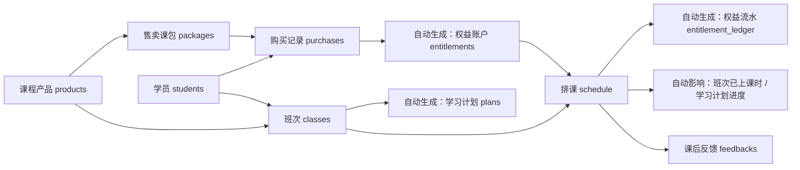
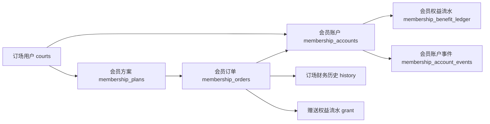

# FlowTennis 平台业务逻辑与字段关系说明

> 2026-05 最新治理口径：
> 教学售卖主链路以 `售卖课包 -> 购买记录 -> 课包余额 -> 排课消课` 为准。
> `课程产品 / 班次管理 / 学习计划` 目前只保留历史兼容用途，不再作为新增功能依赖。
> 详细见 [教学售卖链路治理说明.md](/Users/shaobaolu/Desktop/FlowTennis/flowtennis-mgmt-main/docs/教学售卖链路治理说明.md)。

这份文档不是“页面介绍”。

这份文档回答的是下面这些更关键的问题：

1. 系统里到底有哪些核心对象
2. 每个对象的关键字段是什么
3. 字段之间怎么关联
4. 谁是数据源，谁只是展示结果
5. 哪些数据是自动生成的
6. 哪些状态会流转
7. 哪些字段改了会影响别的地方

这份文档的目标是：

- 让一个新人看完后，能真正理解这个平台的主逻辑
- 让你以后继续做功能时，不会再出现“这个字段到底归谁管”的混乱

---

## 一、先看治理分层

### 1. 活跃主链

- 对象：`packages / purchases / entitlements / entitlement_ledger / schedule`
- 口径：教学售卖、购课、余额、消课、新增规则，默认都从这里理解

### 2. 历史兼容页面

- 页面：`课程产品`、`班次管理`、`学习计划`
- 口径：页面仍可见，但主要承担旧数据维护、核对、追溯

### 3. 历史兼容接口

- 接口：`/products`、`/classes`、`/plans`
- 口径：
  - `/plans` 只保留读取和按班次自动同步生成，不允许独立写入
  - `/products`、`/classes` 还保留写能力，但仅限历史维护，不再作为新增业务模型源头

---

## 二、先说结论：这个平台本质上是两套业务系统

### 1. 教学履约系统

主对象：

- 学员 `students`
- 课程产品 `products`
- 售卖课包 `packages`
- 购买记录 `purchases`
- 权益账户 `entitlements`
- 权益流水 `entitlement_ledger`
- 班次 `classes`
- 学习计划 `plans`
- 排课 `schedule`
- 课后反馈 `feedbacks`

### 2. 场地会员系统

主对象：

- 订场用户 `courts`
- 会员方案 `membership_plans`
- 会员账户 `membership_accounts`
- 会员订单 `membership_orders`
- 会员权益流水 `membership_benefit_ledger`
- 会员账户事件 `membership_account_events`

### 3. 基础资料层

- 教练 `coaches`
- 校区 `campuses`
- 用户账号 `users`

---

## 三、最重要的一句话

这个系统不是“每个页面自己存一份数据”。

真正的逻辑是：

- 有些表是“源数据”
- 有些表是“自动生成结果”
- 有些页面只是“展示汇总”

如果不先分清这个，你后面看任何页面都会混乱。

---

## 四、教学系统主链路

这里分两层看：

- 活跃主链：`packages -> purchases -> entitlements -> schedule -> entitlement_ledger`
- 历史兼容链：`products -> classes -> plans`

下面这张图描述的是当前代码里的历史全链路，不代表后续新增需求仍然应该按这条链继续扩展。

可以简单理解为：

1. 先定义课程
2. 再定义怎么卖
3. 学员购买后生成课时权益
4. 学员进入班次
5. 班次生成学习计划
6. 具体每节课落到排课
7. 排课再去扣课时、推进行课时、写反馈

---

## 五、场地会员系统主链路

可以简单理解为：

1. 先有订场用户
2. 再配置会员方案
3. 开卡/续充时生成会员订单
4. 同时更新会员账户
5. 同时写充值历史
6. 同时写赠送权益流水
7. 后续消耗、补发、作废都继续写权益流水和账户事件

---

## 六、对象说明：谁是谁，谁依赖谁

下面只讲“关键对象”和它们的真实职责。

---

### 1. 学员 `students`

它是什么：

- 教学系统里的“人”
- 是上课对象，不等于订场用户

关键字段：

- `id`：学员唯一 ID
- `name`：学员姓名
- `phone`：手机号
- `type`：学员类型，例如成人、青少年
- `campus`：所属校区
- `source`：来源
- `notes`：备注

它和谁关联：

- 被 `purchases` 引用
- 被 `entitlements` 引用
- 被 `classes` 通过 `studentIds` 引用
- 被 `plans` 引用
- 被 `schedule` 通过 `studentIds` 引用
- 被 `feedbacks` 引用
- 还可能和 `courts` 弱关联

删除规则：

- 只要已经被班次、排课、计划、购买、权益、反馈、订场关联使用，就不能直接删

结论：

- `students` 是教学系统的人物主表
- 一旦进入业务链，基本只能维护，不能随便删

---

### 2. 课程产品 `products`

> 当前定位：历史兼容模块，不再作为新增功能入口。

它是什么：

- 课程模板
- 定义“这是什么课”

关键字段：

- `id`
- `name`：课程名称
- `type`：课程类型
- `maxStudents`：人数上限
- `price`：默认价格
- `lessons`：默认课时
- `notes`

它和谁关联：

- 被 `classes.productId` 引用
- 被 `packages.productId` 引用

它不负责什么：

- 不负责售卖时间
- 不负责可用教练
- 不负责可用校区
- 不负责学员余额

删除/编辑规则：

- 一旦被班次或课包引用，不能删
- 一旦被班次或课包引用，`type/maxStudents/lessons/price` 这些核心字段不能再改

结论：

- `products` 只回答“课是什么”
- 不回答“课怎么卖”

---

### 3. 售卖课包 `packages`

它是什么：

- 可卖给学员的商品
- 是“课程产品”的销售包装

最新治理口径：

- 后续新增需求应直接把它当成教学售卖主对象
- 不再继续强化“必须先有课程产品”这层依赖

关键字段：

- `id`
- `name`
- `productId`
- `productName`
- `courseType`
- `price`
- `lessons`
- `validDays`
- `saleStartDate / saleEndDate`
- `usageStartDate / usageEndDate`
- `dailyTimeWindows`
- `timeBand`
- `coachIds / coachNames`
- `campusIds`
- `maxStudents`
- `status`

它和谁关联：

- 上游依赖 `products`
- 下游被 `purchases` 引用
- 它的规则会被复制到 `purchases`
- 再继续复制到 `entitlements`

它的真正作用：

- 定义课包卖多少钱
- 定义一共几节
- 定义什么时候能买
- 定义什么时候能用
- 定义哪些教练可用
- 定义哪些校区可用
- 定义适合几人使用

编辑规则：

- 如果已经有购买记录，就不能改核心规则
- 不能改的核心项包括：
  `productId/productName/courseType/price/lessons/validDays/saleStartDate/saleEndDate/usageStartDate/usageEndDate/dailyTimeWindows/timeBand/coachIds/coachNames/campusIds/maxStudents`

删除规则：

- 如果已有购买记录，不能删，只能停用

结论：

- `packages` 是教学系统里最重要的“销售规则表”
- 学员实际拿到的权益，是从这里复制出去的

---

### 4. 购买记录 `purchases`

它是什么：

- 某个学员买了一次某个课包的事实记录

关键字段：

- `id`
- `studentId / studentName / studentPhone`
- `packageId / packageName`
- `productId / productName`
- `courseType`
- `packageLessons`
- `packagePrice`
- `packageTimeBand`
- `dailyTimeWindows`
- `coachIds / coachNames`
- `campusIds`
- `usageStartDate / usageEndDate`
- `purchaseDate`
- `amountPaid`
- `payMethod`
- `status`

注意：

- `purchases` 不是只存一个 `packageId`
- 它会把买的时候的规则快照一起存下来

为什么要这样：

- 因为课包以后可能停售
- 展示名可能会改
- 但历史购买不能跟着未来规则乱变

自动联动：

- 新增购买后，系统会自动生成一条 `entitlements`

修改规则：

- 如果这笔购买还没有产生课时消耗，可以改，并同步更新权益账户
- 如果这笔购买已经产生课时消耗，就只能改备注

作废规则：

- 如果对应权益已经有消耗流水，不能直接作废
- 如果允许作废：
  - 购买记录状态会变成 `voided`
  - 对应权益账户会变成 `voided`
  - 同时写入一条权益流水，动作是 `void_purchase`

结论：

- `purchases` 是“买了这件事”的证据表
- 同时也是权益账户的生成起点

---

### 5. 权益账户 `entitlements`

它是什么：

- 学员买完课包之后的“可用课时账户”

关键字段：

- `id`
- `studentId / studentName`
- `purchaseId`
- `packageId / packageName`
- `productId / productName`
- `courseType`
- `totalLessons`
- `usedLessons`
- `remainingLessons`
- `validFrom / validUntil`
- `usageStartDate / usageEndDate`
- `dailyTimeWindows`
- `timeBand`
- `coachIds / coachNames`
- `campusIds`
- `maxStudents`
- `status`

它是怎么来的：

- 不是手工创建的主对象
- 正常情况下由 `purchases` 自动生成

它记录的不是“当前课包配置”，而是“买的时候这份权益长什么样”

所以它其实是：

- 学员课时余额账户
- 同时也是可用规则快照

状态逻辑：

- `active`：可用
- `depleted`：课时用完
- `voided`：购买作废后失效

关键校验逻辑：

- 排课只能用 `active` 状态的权益
- 剩余课时必须够
- 学员必须匹配
- 课程类型必须匹配
- 教练必须匹配
- 校区必须匹配
- 日期必须在可用期内
- 时间必须在可用时段内
- 人数不能超上限

结论：

- `entitlements` 是教学系统里最关键的“可履约账户”
- 排课不是直接扣购买记录，而是扣这里

---

### 6. 权益流水 `entitlement_ledger`

它是什么：

- 每一次扣课、退课、作废、调整的证据表

关键字段：

- `id`
- `entitlementId`
- `studentId`
- `scheduleId`
- `lessonDelta`
- `action`
- `reason`
- `operator`
- `createdAt`

它的作用：

- 记录为什么这次课时发生变化
- 让“剩余课时”有审计证据

结论：

- `entitlements` 是余额
- `entitlement_ledger` 是余额变化证据

---

### 7. 班次 `classes`

> 当前定位：历史兼容对象。接口仍可写，但只用于旧页面维护，不再作为新增教学售卖前置。

它是什么：

- 长周期教学组织
- 不是某一节课，而是一整个班

关键字段：

- `id`
- `classNo`
- `className`
- `productId / productName`
- `studentIds`
- `coach`
- `campus`
- `totalLessons`
- `usedLessons`
- `startDate / endDate`
- `status`

自动联动：

- 新建班次后，会自动为班里每个学员生成一条 `plans`

关键限制：

- 如果这个班次已经有排课，就不能随便改：
  - 课程产品
  - 教练
  - 校区
  - 学员
  - 总课时
- `usedLessons` 不能手改，只能由排课自动维护

状态逻辑：

- 常见状态是 `已排班`
- 可以进入 `已结课`
- 可以进入 `已取消`

额外限制：

- 如果还有剩余课时，不能直接结课
- 如果已有排课，不能直接取消

结论：

- `classes` 是“长期教学组织”
- 不是售卖对象，也不是课时余额对象

---

### 8. 学习计划 `plans`

> 当前定位：历史兼容对象。接口只保留读取，记录继续由班次自动同步生成。

它是什么：

- 班次和学员之间的展开结果
- 一般是一条“某学员在某班次里的计划记录”

关键字段：

- `classId`
- `studentId / studentName / studentPhone`
- `className`
- `productName`
- `coach`
- `campus`
- `totalLessons`
- `usedLessons`
- `status`

它是怎么来的：

- 由 `classes` 自动生成
- 不能独立新增、修改、删除

状态逻辑：

- 班次是 `已取消`，计划就变 `已取消`
- 班次是 `已结课`，计划就变 `已结课`
- 否则通常是 `active`

结论：

- `plans` 不是独立业务对象
- 更像 `classes × students` 的展开视图

---

### 9. 排课 `schedule`

它是什么：

- 真正发生的一节课
- 是教学履约最核心的执行对象

关键字段：

- `id`
- `classId`
- `studentId / studentIds / studentName`
- `entitlementId`
- `startTime / endTime`
- `coach / coachId`
- `campus`
- `venue`
- `courseType`
- `lessonCount`
- `status`
- `cancelReason`
- `notifyStatus`
- `confirmStatus`
- `scheduleSource`

它依赖谁：

- 学员
- 教练
- 校区
- 场地
- 班次（可选但常见）
- 权益账户（如果是可计费课程）

它会影响谁：

- 扣减 `entitlements`
- 写入 `entitlement_ledger`
- 推进 `classes.usedLessons`
- 推进 `plans.usedLessons`
- 决定教练端“工作台 / 我的课表”展示
- 课后可以生成 `feedbacks`

关键规则：

- 只有可计费排课才需要权益逻辑
- 多人排课目前不支持绑定单个权益账户
- 如果已经有反馈，很多核心字段不能再改
- 如果已有权益消耗和反馈，不能直接删

状态逻辑：

- `已排课`
- `已取消`
- `已结束`

注意：

- 前端会把“已排课但结束时间已过去”的课展示成 `已结束`

结论：

- `schedule` 是教学执行的中心
- 课时消耗、计划推进、教练任务，最终都围绕它转

---

### 10. 课后反馈 `feedbacks`

它是什么：

- 某节课上完后的记录

关键字段：

- `scheduleId`
- `studentId / studentIds / studentName`
- `coach`
- `knowledgePoint`
- `nextTraining`
- `playerLevel`
- `goalType`
- `experienceBackground`
- `mainIssues`
- `conversionIntent`
- `recommendedProductType`
- `needOpsFollowUp`
- `opsFollowUpPriority`
- `opsFollowUpSuggestion`

它的作用：

- 记录教学反馈
- 记录转化意向
- 记录运营跟进建议

反向影响：

- 一旦某条排课已有反馈
- 那条排课的核心字段就会被锁住，不能再大改

结论：

- `feedbacks` 不是独立排课配置
- 它是排课执行结果

---

## 六、场地会员对象说明

### 1. 订场用户 `courts`

它是什么：

- 场地业务里的“人”
- 也是会员业务的客户主表

关键字段：

- `id`
- `name`
- `phone`
- `campus`
- `studentId / studentIds`
- `history`
- `balance`
- `totalDeposit`
- `spentAmount`
- `recentFollowUpDate`
- `nextFollowUpDate`

它和谁关联：

- 被 `membership_accounts` 引用
- 被 `membership_orders` 引用
- 被 `membership_benefit_ledger` 引用
- 被 `membership_account_events` 引用

删除规则：

- 有财务流水、会员账户、会员订单、会员权益流水、会员账户事件时，不能直接删

结论：

- `courts` 是场地和会员系统里的客户主表

---

### 2. 会员方案 `membership_plans`

它是什么：

- 会员商品配置

关键字段：

- `id`
- `name`
- `tierCode`
- `rechargeAmount`
- `bonusAmount`
- `discountRate`
- `saleStartDate / saleEndDate`
- `validMonths`
- `maxMonths`
- `benefitTemplate`
- `status`

它和谁关联：

- 被 `membership_orders` 引用

状态逻辑：

- `draft`
- `active`
- `inactive`
- 前端还会根据售卖结束时间显示“已结束”

删除规则：

- 上架中的方案不能删
- 已有购买记录的方案不能删

结论：

- `membership_plans` 是会员系统的商品规则来源

---

### 3. 会员账户 `membership_accounts`

它是什么：

- 某个订场用户当前的会员账户

关键字段：

- `id`
- `courtId / courtName`
- `status`
- `memberTag`
- `memberLabel`
- `discountRate`
- `cycleStartDate`
- `validUntil`
- `hardExpireAt`
- `autoExtended`
- `lastQualifiedRechargeAmount`
- `lastOrderId`

它是怎么来的：

- 开卡/续充时自动生成或更新

它和什么不同：

- `membership_orders` 是订单
- `membership_accounts` 是当前账户快照

状态逻辑：

- `active`
- `extended`
- `cleared`
- `voided`
- 前端还会根据有效期显示“30天内到期”

自动逻辑：

- 一年期到期但余额还有值，会自动进入 `extended`
- 两年到期后余额会自动清零，进入 `cleared`

结论：

- `membership_accounts` 是会员系统里的“当前状态表”

---

### 4. 会员订单 `membership_orders`

它是什么：

- 某一次开卡/续充/充值记录

关键字段：

- `id`
- `membershipAccountId`
- `courtId / courtName`
- `membershipPlanId / membershipPlanName`
- `rechargeAmount`
- `bonusAmount`
- `discountRate`
- `purchaseDate`
- `cycleStartDate`
- `validUntil`
- `hardExpireAt`
- `qualifiesRenewalReset`
- `benefitSnapshot`
- `benefitValidUntil`
- `status`

自动联动：

- 生成或更新 `membership_accounts`
- 写入 `courts.history`
- 生成赠送权益流水 `grant`

结论：

- `membership_orders` 是会员系统里的订单事实表

---

### 5. 会员权益流水 `membership_benefit_ledger`

它是什么：

- 会员赠送权益的流水表

关键字段：

- `membershipOrderId`
- `membershipAccountId`
- `courtId`
- `benefitCode / benefitLabel`
- `delta`
- `action`
- `reason`
- `operator`
- `relatedDate`
- `createdAt`

动作类型：

- `grant`：开卡/续充赠送
- `consume`：使用
- `supplement`：补发
- `adjust`：调整
- `void`：作废

它的作用：

- 记录某项会员权益为什么增加或减少

结论：

- 和教学系统里的 `entitlement_ledger` 一样
- 这是“权益变化证据表”

---

### 6. 会员账户事件 `membership_account_events`

它是什么：

- 记录会员账户状态变化事件

典型事件：

- `auto_extend`
- `auto_clear`

它的作用：

- 用来解释为什么账户状态变了

---

## 七、字段关系：谁带出谁，谁引用谁

这一段最重要。

---

### 1. 教学链里的字段传递关系

#### `products -> packages`

会传递或继承的核心语义：

- `productId`
- `productName`
- `courseType`
- `maxStudents`

但 `packages` 会补充自己的销售规则：

- `price`
- `lessons`
- `validDays`
- `saleStartDate / saleEndDate`
- `usageStartDate / usageEndDate`
- `timeBand`
- `dailyTimeWindows`
- `coachIds`
- `campusIds`

#### `packages -> purchases`

购买时会把课包规则快照复制进购买记录：

- `packageId / packageName`
- `productId / productName`
- `courseType`
- `packageLessons`
- `packagePrice`
- `packageTimeBand`
- `dailyTimeWindows`
- `coachIds / coachNames`
- `campusIds`
- `usageStartDate / usageEndDate`

所以：

- `purchases` 里存的是“买的时候的规则”
- 不是实时读 `packages`

#### `purchases -> entitlements`

购买成功后，自动生成权益账户，并复制这些关键字段：

- `studentId / studentName`
- `purchaseId`
- `packageId / packageName`
- `productId / productName`
- `courseType`
- `totalLessons`
- `validFrom / validUntil`
- `usageStartDate / usageEndDate`
- `dailyTimeWindows`
- `timeBand`
- `coachIds / coachNames`
- `campusIds`
- `maxStudents`

所以：

- `entitlements` 是可用规则 + 剩余课时账户

#### `classes -> plans`

班次会按 `studentIds` 自动展开成计划：

- 一个班次里有几个学员
- 就会有几条 `plans`

会复制：

- `classId`
- `studentId / studentName / studentPhone`
- `className`
- `productName`
- `coach`
- `campus`
- `totalLessons`
- `usedLessons`
- `status`

#### `schedule -> entitlement_ledger`

排课如果绑定了权益账户，并且是可计费课，就会产生课时变化记录。

也就是说：

- 真正扣课不是靠前端改 `remainingLessons`
- 而是靠排课动作触发流水，再反推余额

---

### 2. 会员链里的字段传递关系

#### `membership_plans -> membership_orders`

开卡/续充时会复制：

- `membershipPlanId / membershipPlanName`
- `rechargeAmount`
- `bonusAmount`
- `discountRate`
- `benefitSnapshot`
- `benefitValidUntil`

#### `membership_orders -> membership_accounts`

订单会更新账户当前状态：

- 当前会员名称
- 当前折扣
- 当前周期开始时间
- 当前有效期
- 最晚清零时间
- 最近一笔订单 ID

#### `membership_orders -> membership_benefit_ledger`

订单生成后，会自动写 `grant` 类型的赠送权益流水

---

## 八、谁是权威数据源

这部分很关键。

### 1. 这些表是“源数据”

- `students`
- `products`
- `packages`
- `purchases`
- `classes`
- `schedule`
- `courts`
- `membership_plans`
- `membership_orders`

### 2. 这些表更像“自动结果”

- `entitlements`
- `plans`
- `membership_accounts`

### 3. 这些表是“流水/证据”

- `entitlement_ledger`
- `membership_benefit_ledger`
- `membership_account_events`

### 4. 这些页面很多时候只是“展示聚合”

- 学员信息页：汇总学员、班次、排课、课包、订场、会员
- 会员管理页：汇总 courts + membership_accounts + membership_orders + benefit ledger
- 教练工作台：汇总 schedule + feedbacks

---

## 九、状态流转说明

## 1. 售卖课包 `packages.status`

主状态：

- `active`
- `inactive`

规则：

- 有购买记录后不能删
- 只能停用

---

## 2. 购买记录 `purchases.status`

主状态：

- `active`
- `voided`

规则：

- 还没产生课时消耗时，才可能作废
- 作废后会同步影响对应权益

---

## 3. 权益账户 `entitlements.status`

主状态：

- `active`
- `depleted`
- `voided`

流转：

- 新购买 -> `active`
- 课时用完 -> `depleted`
- 购买作废 -> `voided`

---

## 4. 班次 `classes.status`

主状态：

- `已排班`
- `已结课`
- `已取消`

规则：

- 已有排课时，不能随便取消
- 还有剩余课时，不能直接结课

---

## 5. 学习计划 `plans.status`

主状态：

- `active`
- `已结课`
- `已取消`

来源：

- 跟随班次状态自动变化

---

## 6. 排课 `schedule.status`

主状态：

- `已排课`
- `已取消`
- `已结束`

注意：

- `已结束` 有一部分是根据时间自动推断出来的展示状态

---

## 7. 会员方案 `membership_plans.status`

主状态：

- `draft`
- `active`
- `inactive`

前端扩展展示：

- 如果售卖期已过，也会显示为“已结束”

---

## 8. 会员账户 `membership_accounts.status`

主状态：

- `active`
- `extended`
- `cleared`
- `voided`

流转：

- 开卡/续充 -> `active`
- 一年期到但余额还有值 -> `extended`
- 两年到期自动清零 -> `cleared`
- 管理员作废 -> `voided`

---

## 十、自动联动规则

这一段你后面做功能时一定要守住。

### 1. 购买课包 -> 自动生成权益账户

不是可选行为，是系统强规则。

### 2. 编辑购买记录 -> 同步更新权益账户

前提：

- 这笔购买还没有被消耗

### 3. 新建班次 -> 自动生成学习计划

班次里每个学员都会生成一条计划

### 4. 修改班次学员列表 -> 自动同步学习计划

- 还在班里的学员更新计划
- 被移出的学员，计划状态改成 `已取消`

### 5. 排课 -> 自动校验权益是否可用

会校验：

- 学员
- 课程类型
- 教练
- 校区
- 日期范围
- 时间范围
- 剩余课时
- 适用人数

### 6. 排课生效 -> 自动扣减课时并写流水

不是手改 `remainingLessons`

### 7. 排课变化 -> 自动影响班次进度和学习计划进度

### 8. 写反馈后 -> 排课核心字段锁定

避免“反馈都写了，课却被改成另一节”的问题

### 9. 开会员 -> 自动生成或更新会员账户

### 10. 开会员 -> 自动生成订单、充值历史、赠送权益流水

### 11. 会员到期 -> 自动延续或自动清零

依据余额和时间自动处理

---

## 十一、不能乱改的字段

这是最实用的一段。

### 1. 课程产品已被引用后，不能乱改

不能乱改：

- 类型
- 人数上限
- 课时
- 价格

### 2. 课包已售出后，不能乱改

不能乱改：

- 产品
- 课程类型
- 价格
- 课时
- 有效天数
- 售卖期
- 使用期
- 使用时间段
- 可用教练
- 可用校区
- 人数限制

### 3. 班次已有排课后，不能乱改

不能乱改：

- 产品
- 教练
- 校区
- 学员
- 总课时

### 4. 已有反馈的排课，不能乱改

不能乱改：

- 学员
- 班次
- 权益账户
- 时间
- 教练
- 校区
- 场地
- 课程类型
- 课时
- 状态

### 5. 已有消耗的购买记录，不能乱改

只能改备注

---

## 十二、新人最容易搞错的地方

### 1. `购买记录` 不是余额

- 购买记录 = 买了
- 权益账户 = 还能用多少

### 2. `班次` 不是具体上课记录

- 班次 = 长周期班级组织
- 排课 = 某一天某一节具体课

### 3. `学习计划` 不是独立编辑对象

- 它是班次自动展开出来的

### 4. `会员订单` 不是会员账户

- 会员订单 = 某次开卡/续充
- 会员账户 = 当前状态

### 5. `学员` 不等于 `订场用户`

- 可能是同一个人
- 但系统里是两条业务线

---

## 十三、如果我是新人，我现在应该怎么理解整个系统

只要记住下面 3 层就够了。

### 第 1 层：人

- 上课的人：`students`
- 订场的人：`courts`
- 教课的人：`coaches`

### 第 2 层：商品/规则

- 课程模板：`products`
- 课包商品：`packages`
- 会员商品：`membership_plans`

### 第 3 层：发生了什么

- 买课：`purchases`
- 形成课时余额：`entitlements`
- 开班：`classes`
- 展开计划：`plans`
- 上课：`schedule`
- 写反馈：`feedbacks`
- 开会员：`membership_orders`
- 形成会员账户：`membership_accounts`

---

## 十四、最终结论

如果只用一句话总结这个系统：

`这是一个以排课和权益结算为核心的教学系统，加上一套以订场用户和会员账户为核心的场地会员系统。`

如果再压缩成两条主线：

### 教学主线

`课程产品 -> 售卖课包 -> 购买记录 -> 权益账户 -> 班次 -> 学习计划 -> 排课 -> 反馈`

### 会员主线

`订场用户 -> 会员方案 -> 会员订单 -> 会员账户 -> 会员权益流水 / 账户事件`

你后面无论新增页面、改逻辑、还是讲给别人听，都应该围着这两条主线来讲。
