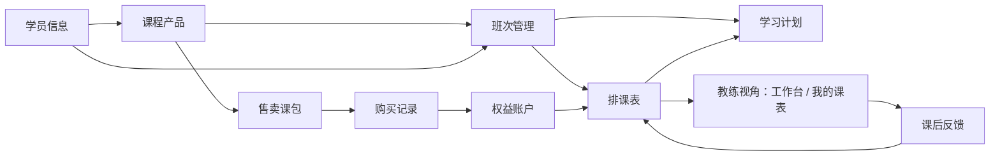
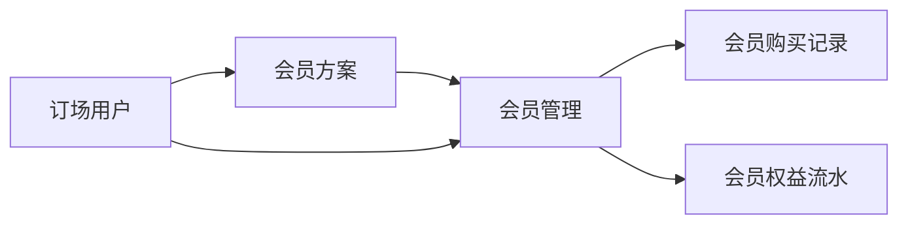
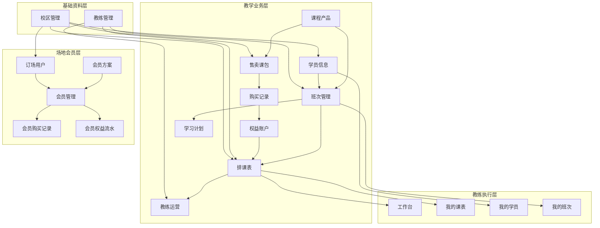

# FlowTennis 平台页面功能总览

> 2026-05 最新口径：
> `课程产品 / 班次管理 / 学习计划` 暂时视为历史兼容页面。
> 业务新增默认只沿 `售卖课包 / 购买记录 / 课包余额 / 排课表` 继续扩展。
> 详见 [教学售卖链路治理说明.md](/Users/shaobaolu/Desktop/FlowTennis/flowtennis-mgmt-main/docs/教学售卖链路治理说明.md)。

这份文档解决 4 个问题：

1. 平台到底有哪些页面
2. 每个页面具体能干什么
3. 每个页面的关键弹窗/子页是什么
4. 主要流程和页面关系怎么串起来

适用对象：

- 你自己重新建立全局认知
- 给运营讲解系统怎么用
- 后续继续做功能时，先知道入口和上下游关系

---

## 一、先看页面治理分层

### 1. 活跃主链页面

- 售卖课包
- 购买记录
- 权益账户
- 排课表

口径：

- 后续新增教学售卖、购课、消课、余额类需求，默认从这些页面继续扩展

### 2. 历史兼容页面

- 课程产品
- 班次管理
- 学习计划

口径：

- 页面保留，但主要用于旧数据维护、核对、追溯
- 不再作为新功能页面设计起点

### 3. 对应历史兼容接口

- `/products`
- `/classes`
- `/plans`

口径：

- `/plans` 只读，不接受独立新增、修改、删除
- `/products`、`/classes` 仍保留写能力，服务当前历史页面维护
- 在没有确认页面已脱离前，不主动冻结 `/products`、`/classes`

---

## 二、平台整体结构

平台现在分成 3 套入口：

1. 登录页
2. 管理员视角
3. 教练视角

可以简单理解为：

- 管理员视角：负责配置、排课、售卖、查账、查会员、查资源
- 教练视角：负责执行课程、看自己的任务、看自己的学员和班次

---

## 三、页面总表

### 1. 登录相关

1. 登录页

### 2. 管理员视角

1. 学员信息
2. 班次管理（历史兼容）
3. 学习计划（历史兼容）
4. 排课表
5. 教练运营
6. 课程产品（历史兼容）
7. 售卖课包
8. 购买记录
9. 权益账户
10. 订场用户
11. 会员管理
12. 会员方案
13. 教练管理
14. 校区管理
15. 会员购买记录
16. 会员权益流水

说明：

- 侧栏主入口里主要显示 14 个核心页面
- “会员购买记录”和“会员权益流水”是从“会员管理”继续进入的独立审计页

### 3. 教练视角

1. 工作台
2. 我的课表
3. 我的学员
4. 我的班次

---

## 四、逐页说明

下面每个页面都按同一个模板写：

- 页面作用
- 页面功能
- 关键弹窗 / 子页
- 关联页面

---

## 五、登录相关

### 1. 登录页

页面作用：

- 输入账号密码进入系统
- 根据账号角色进入管理员视角或教练视角

页面功能：

- 输入账号
- 输入密码
- 点击登录
- 登录成功后进入对应视角
- 登录失败时提示错误

关键弹窗 / 子页：

- 无

关联页面：

- 管理员首页默认进入“学员信息”
- 教练首页默认进入“工作台”

---

## 六、管理员视角

## A. 教学管理

### 1. 学员信息

页面作用：

- 这是学员总台账
- 用来统一看学员基础信息、上课状态、课程关系、订场/会员关联
- 后续学员视图按“历史学员”和“在期学员”区分：历史学员看累计来上过课的人，在期学员看当前仍有运营价值的人

页面功能：

- 搜索学员姓名、手机号、订场账户
- 按学员类型筛选
- 按来源筛选
- 按课包状态、付费方式、活跃状态、历史课时、运营提醒筛选
- 按关联状态筛选
  例如：有班次、无班次、有订场、无订场、有会员、无会员
- 查看学员统计
  例如：历史学员、在期学员、近30天活跃、课包即将耗尽、有余额未活跃
- 分页查看学员列表
- 导出学员 CSV
- 新增学员
- 查看学员详情
- 编辑学员
- 删除学员
- 从列表里看到：
  学员、电话、类型、校区、最近正式课、活跃状态、付费方式、课包状态、历史课时、负责教练、订场/会员、来源、备注

关键弹窗 / 子页：

- 学员详情弹窗
  用来查看教学信息、运营信息、消费与关联信息
- 学员编辑弹窗
  用来新增/编辑姓名、手机号、类型、来源、活动范围、校区、备注

关联页面：

- 和“班次管理”关联：学员会进入班次
- 和“学习计划”关联：学员在班次中会有计划
- 和“排课表”关联：学员会上具体某节课
- 和“购买记录”“权益账户”关联：学员买课包后会形成权益
- 和“订场用户”“会员管理”关联：同一个人可能既是学员又是订场/会员用户

---

### 2. 班次管理

页面作用：

- 管理长期班级
- 决定某个班次属于什么课程、有哪些学员、由哪个教练负责、整体课时进度如何

页面功能：

- 搜索班次、学员、课程
- 按状态筛选
- 按校区筛选
- 按教练筛选
- 按课程类型筛选
- 查看班次统计
- 分页查看班次列表
- 新增班次
- 查看班次详情
- 编辑班次
- 删除班次
- 在列表里查看：
  班次名称、班次编号、课程、学员、课时进度、日期范围、状态

关键弹窗 / 子页：

- 班次编辑弹窗
  用来设置课程产品、学员、教练、日期范围、总课时、状态等
- 班次详情弹窗
  用来查看班次基础信息、学员、课时进度

关联页面：

- 上游依赖“课程产品”
- 下游自动生成“学习计划”
- 下游会进入“排课表”
- 教练侧“我的班次”直接读取这里的数据

---

### 3. 学习计划

页面作用：

- 查看班次自动生成的学习计划
- 用来从“学员-班次-课时进度”这个角度查履约情况

页面功能：

- 搜索计划
- 按状态筛选
- 按校区筛选
- 按教练筛选
- 分页查看计划列表
- 查看每条计划对应的学员
- 查看每条计划对应的班次
- 查看已上课时、剩余课时、计划状态

关键弹窗 / 子页：

- 主要是列表查看页
- 没有独立创建计划的主流程

关联页面：

- 来自“班次管理”自动生成
- 和“排课表”联动，排课会影响计划进度
- 和“学员信息”联动，能反查学员当前学习状态

---

### 4. 排课表

页面作用：

- 管理每一节具体课程
- 这是日常排课执行的核心页面

页面功能：

- 搜索排课
- 按校区筛选
- 按教练筛选
- 按课程类型筛选
- 按状态筛选
- 分页查看排课列表
- 新增排课
- 查看排课详情
- 编辑排课
- 删除排课
- 设置日期、开始时间、结束时间
- 选择学员
- 选择班次
- 选择教练
- 选择校区和场地
- 设置课程类型
  例如：私教课、体验课、训练营、大师课
- 设置取消原因
- 设置通知状态
- 设置排课来源
- 查看反馈状态

关键弹窗 / 子页：

- 排课编辑弹窗
  用来新增/编辑一节具体课程
- 课程详情弹窗
  用来查看某节课的完整信息
- 反馈填写弹窗
  用来填写课后反馈、转化建议、运营跟进建议

关联页面：

- 上游来自“班次管理”“学员信息”“教练管理”“校区管理”
- 上课后反馈会进入教练执行链路
- 会影响“学习计划”
- 会影响“权益账户”的课时消耗
- 教练侧“工作台”“我的课表”直接依赖这里

---

### 5. 教练运营

页面作用：

- 从运营角度看教练排班和负载
- 比排课表更适合做教练调度和排班观察

页面功能：

- 在“教练排课”和“教练工作量”之间切换
- 切换日视图、周视图、月视图
- 查看某个时间范围的教练安排
- 快速新增排课
- 通过时间轴查看每个教练的课程分布
- 查看课程类型图例
- 查看每个教练的总课数、总时长、未反馈数
- 查看校区分布
- 查看时间段分布
- 查看排班风险
  例如：冲突、跨校区太紧
- 点开某个课程块进入课程详情

关键弹窗 / 子页：

- 快速新增排课弹窗
- 课程详情弹窗

关联页面：

- 和“排课表”是同一批排课数据的两个不同视角
- 和“教练管理”联动
- 教练侧“工作台”“我的课表”会消费这里对应的数据结果

---

## B. 课程管理

### 6. 课程产品

页面作用：

- 定义课程本身是什么
- 这是课程体系的基础配置页

页面功能：

- 查看课程产品卡片列表
- 新增课程产品
- 编辑课程产品
- 删除课程产品
- 查看课程名称
- 设置课程类型
- 设置人数
- 设置定价
- 设置课时
- 设置备注
- 区分是否已被引用
- 被班次/课包引用后，核心字段锁定，避免历史数据被改乱

关键弹窗 / 子页：

- 课程产品编辑弹窗
  用来设置名称、类型、人数、价格、课时、备注

关联页面：

- 下游被“班次管理”引用
- 下游被“售卖课包”引用
- 没有课程产品，后续很多课程相关流程都走不起来

---

### 7. 售卖课包

页面作用：

- 把课程产品包装成真正拿去卖的商品
- 定义售卖规则和使用规则

页面功能：

- 查看课包卡片列表
- 搜索课包
- 按产品筛选
- 按状态筛选
- 新增课包
- 编辑课包
- 删除课包
- 查看课包价格
- 查看课包课时数
- 查看适用人数
- 设置活动开始/结束日期
- 设置使用开始/结束日期
- 设置有效天数
- 设置使用时段
- 设置可用教练
- 设置可用校区
- 设置课包状态
  例如：启用、停用
- 快速跳转查看该课包对应的购买记录

关键弹窗 / 子页：

- 课包编辑弹窗
  用来设置价格、课时、可用教练、可用校区、活动期、使用期、时段规则等

关联页面：

- 上游依赖“课程产品”
- 下游进入“购买记录”
- 学员购买后会生成“权益账户”

---

### 8. 购买记录

页面作用：

- 管理谁买了什么课包
- 这是查账和追溯的核心页

页面功能：

- 查看购买记录列表
- 搜索购买记录
- 新增购买
- 查看购买详情
- 编辑购买记录
- 作废购买记录
- 查看购买日期
- 查看学员
- 查看购买的课包
- 查看实收金额
- 查看支付方式
- 查看状态
- 查看购买时规则快照
  例如：购买时使用的是哪个产品、多少课时、哪些教练/校区可用
- 支持导出/导入购买数据

关键弹窗 / 子页：

- 购买详情弹窗
  用来查看购买时规则快照
- 购买编辑弹窗
  用来改学员、课包、日期、金额、支付方式、备注
- 购买作废弹窗
  用来填写作废原因

关联页面：

- 上游依赖“学员信息”“售卖课包”
- 下游生成“权益账户”
- 会影响“排课表”里的可用权益匹配

---

### 9. 权益账户

页面作用：

- 管理学员买课包之后的剩余课时
- 这是课时余额和履约消耗的核心页

页面功能：

- 查看权益账户列表
- 搜索权益账户
- 按学员筛选
- 查看所属学员
- 查看课包名称
- 查看课程类型
- 查看总课时
- 查看已用课时
- 查看剩余课时
- 查看有效期
- 查看状态
- 查看权益流水
- 看系统推荐该排课可绑定哪个权益

关键弹窗 / 子页：

- 权益详情查看
- 权益流水查看

关联页面：

- 来自“购买记录”
- 被“排课表”消耗
- 会反映到“学员信息”里的课包/课时信息

---

## C. 场地与资源

### 10. 订场用户

页面作用：

- 管理场地客户
- 也是场地财务和会员入口页

页面功能：

- 搜索订场用户
- 按账户类型筛选
- 按负责人筛选
- 排序查看余额、消费、到期时间等
- 查看订场用户统计
- 分页查看列表
- 调整每页显示条数
- 新增订场用户
- 查看详情
- 编辑资料
- 删除或隐藏用户
- 批量删除/隐藏
- 记录财务流水
- 查看会员到期
- 查看当前余额
- 查看消费金额
- 查看末次跟进日期
- 查看下次跟进日期
- 导入 CSV
- 财务迁移预览
- 备份数据
- 进入会员账户面板

关键弹窗 / 子页：

- 订场用户编辑弹窗
  用来维护基础资料、跟进日期、关联信息
- 财务流水弹窗
  用来记一笔充值/消费/订场流水，并查看历史记录
- 会员账户面板
  用来查看当前会员状态、当前权益、最近开卡、作废信息、会员操作入口

关联页面：

- 和“会员管理”强关联
- 和“会员方案”强关联
- 和“学员信息”有弱关联
  因为同一个人可能既订场又上课

---

### 11. 会员管理

页面作用：

- 查看已经开通会员的人
- 看会员余额、折扣、权益和有效期

页面功能：

- 搜索会员姓名、手机号、方案
- 查看会员统计
  例如：会员数、订购次数、总收入金额、总余额
- 查看会员列表
- 查看当前会员档位
- 查看会员状态
- 查看余额
- 查看折扣
- 查看可用权益
- 查看余额有效期
- 查看清零时间
- 打开会员账户详情
- 跳转查看会员购买记录
- 跳转查看会员权益流水

关键弹窗 / 子页：

- 会员账户详情面板
  用来查看某个会员的详细账户状态和权益
- “会员购买记录”审计页
- “会员权益流水”审计页

关联页面：

- 上游依赖“订场用户”“会员方案”
- 下游进入“会员购买记录”“会员权益流水”

---

### 12. 会员方案

页面作用：

- 配置会员卖什么
- 这是会员业务的商品配置页

页面功能：

- 搜索会员方案
- 查看方案列表
- 新增会员方案
- 编辑会员方案
- 删除会员方案
- 上架会员方案
- 停售会员方案
- 设置方案名称
- 设置档位
- 设置充值金额
- 设置赠送金额
- 设置折扣
- 设置售卖开始/结束日期
- 设置方案状态
- 设置赠送权益
  例如：公开课、穿线、发球机、陪打等
- 设置指定教练权益
- 设置备注

关键弹窗 / 子页：

- 会员方案编辑弹窗
  用来配置金额、折扣、时间、权益内容、指定教练、备注

关联页面：

- 下游被“会员管理”消费
- 下游生成“会员购买记录”和“会员权益流水”

---

### 13. 教练管理

页面作用：

- 管理教练基础资料

页面功能：

- 搜索教练姓名、电话、备注
- 查看教练列表
- 新增教练
- 编辑教练
- 删除教练
- 查看所属校区
- 查看入职时间
- 查看状态
- 查看备注

关键弹窗 / 子页：

- 教练编辑弹窗
  用来设置姓名、电话、校区、入职时间、状态、备注

关联页面：

- 被“班次管理”引用
- 被“排课表”引用
- 被“教练运营”引用
- 被教练视角页面引用

---

### 14. 校区管理

页面作用：

- 管理系统里的校区基础信息

页面功能：

- 搜索校区名称或代码
- 查看校区列表
- 新增校区
- 编辑校区
- 删除校区
- 查看校区名称
- 查看校区代码
- 查看创建时间

关键弹窗 / 子页：

- 校区编辑弹窗
  用来设置校区名称、校区代码

关联页面：

- 被“学员信息”引用
- 被“教练管理”引用
- 被“排课表”引用
- 被“订场用户”引用
- 被“售卖课包”引用

---

### 15. 会员购买记录

页面作用：

- 只看会员开卡/购买历史
- 偏审计和追溯，不是日常主操作页

页面功能：

- 从会员管理页进入
- 按时间查看会员购买记录
- 查看购买日期
- 查看订场用户
- 查看会员方案
- 查看充值金额
- 查看赠送金额
- 查看折扣
- 查看是否重置有效期
- 查看当次权益摘要
- 查看状态
- 返回会员管理

关键弹窗 / 子页：

- 无，主要是独立审计列表页

关联页面：

- 从“会员管理”跳入
- 数据来自“会员方案”“订场用户”的实际购买行为

---

### 16. 会员权益流水

页面作用：

- 只看会员权益的变化记录
- 用来追溯某项权益为什么变少、变多、作废

页面功能：

- 从会员管理页进入
- 按时间查看权益流水
- 查看订场用户
- 查看购买批次
- 查看权益名称
- 查看变动数量
- 查看动作类型
  例如：消耗、补发、调整、作废
- 查看操作账号
- 查看原因
- 返回会员管理

关键弹窗 / 子页：

- 无，主要是独立审计列表页

关联页面：

- 从“会员管理”跳入
- 和“会员方案”“订场用户”“会员账户”联动

---

## 六、教练视角

### 1. 工作台

页面作用：

- 教练每天进系统后的总入口
- 让教练一眼看到自己今天最重要的课和任务

页面功能：

- 查看今日课程总览
- 查看统计卡片
- 查看当前时间
- 按状态分组查看课程
  例如：进行中、即将开始、待反馈、已完成
- 查看课程时间
- 查看学员
- 查看课程类型
- 查看校区和场地
- 查看提醒信息
- 打开课程详情
- 直接去填写反馈

关键弹窗 / 子页：

- 课程详情弹窗
- 反馈填写弹窗

关联页面：

- 数据来自“排课表”
- 执行动作会回写到“排课表”“反馈记录”

---

### 2. 我的课表

页面作用：

- 看自己本周的排课安排

页面功能：

- 查看本周总览
- 按周切换查看
- 查看每节课的时间范围
- 查看课程类型
- 查看校区
- 查看反馈状态
- 点开课程查看详情

关键弹窗 / 子页：

- 课程详情弹窗
- 反馈查看/填写弹窗

关联页面：

- 数据直接来自“排课表”
- 和“工作台”是同一批数据的不同展示方式

---

### 3. 我的学员

页面作用：

- 让教练查看自己带的学员

页面功能：

- 查看自己的学员列表
- 查看学员姓名
- 查看校区
- 查看电话
- 查看学员类型
- 查看所上班次
- 查看剩余课时
- 查看备注摘要
- 查看学员详情

关键弹窗 / 子页：

- 我的学员详情弹窗
  用来查看基础信息、所上班次、最近上课、备注

关联页面：

- 学员基础数据来自“学员信息”
- 上课情况来自“排课表”
- 班次关系来自“班次管理”

---

### 4. 我的班次

页面作用：

- 让教练查看自己负责的班次和进度

页面功能：

- 查看自己的班次列表
- 查看班次名称和编号
- 查看课程
- 查看班次学员
- 查看课时进度
- 查看日期范围
- 查看状态
- 查看班次详情

关键弹窗 / 子页：

- 我的班次详情弹窗
  用来查看班次信息、课程、学员、日期、课时进度

关联页面：

- 数据来自“班次管理”
- 进度受“排课表”影响

---

## 七、主要流程图

### 1. 教学主流程

一句话：

- 先有人
- 再定义课
- 再卖课
- 再形成权益
- 再排进班次
- 再落到具体排课
- 教练去执行和反馈

---

### 2. 场地会员主流程

一句话：

- 先有订场用户
- 再配置会员方案
- 再开会员账户
- 最后去看购买和权益变化

---

## 八、主要页面关系图

---

## 九、如果给运营讲，建议怎么讲

建议顺序不要按菜单讲，按业务讲。

### 第一段：先讲平台分两条大业务线

1. 教学线
2. 场地会员线

### 第二段：讲教学线

1. 学员信息：先管人
2. 课程产品：定义课是什么
3. 售卖课包：定义课怎么卖
4. 购买记录：记录谁买了
5. 权益账户：记录还剩多少课
6. 班次管理：把人编进班
7. 学习计划：看班次计划
8. 排课表：安排每一节具体课
9. 教练运营：从教练角度监控排班

### 第三段：讲场地会员线

1. 订场用户：管场地客户
2. 会员方案：定义会员商品
3. 会员管理：看会员账户
4. 会员购买记录：查开卡历史
5. 会员权益流水：查权益变化

### 第四段：讲教练线

1. 工作台：今日任务入口
2. 我的课表：看本周课
3. 我的学员：看自己带谁
4. 我的班次：看自己负责哪些班

---

## 十、最容易混淆的 5 组概念

### 1. 课程产品 vs 售卖课包

- 课程产品：课程本身是什么
- 售卖课包：这个课程怎么卖

### 2. 购买记录 vs 权益账户

- 购买记录：买了这件事
- 权益账户：买完以后还剩什么

### 3. 班次管理 vs 排课表

- 班次管理：长期班
- 排课表：某一天某一节具体课

### 4. 会员方案 vs 会员管理

- 会员方案：卖什么会员
- 会员管理：谁已经买了会员

### 5. 学员信息 vs 订场用户

- 学员信息：上课的人
- 订场用户：订场/场地消费的人
- 可能是同一个人，但现在属于两条业务线

---

## 十一、结论

这个平台现在的本质不是“很多散页面”，而是两套业务系统放在一起：

1. 教学履约系统
2. 场地会员系统

你现在最需要记住的不是每个按钮，而是这两条主链路：

1. 教学线：
`学员 -> 课程产品 -> 售卖课包 -> 购买记录 -> 权益账户 -> 班次 -> 学习计划 -> 排课 -> 教练执行`

2. 会员线：
`订场用户 -> 会员方案 -> 会员管理 -> 会员购买记录 / 会员权益流水`

只要这两条线你讲顺了，运营基本就能听懂整个系统。
