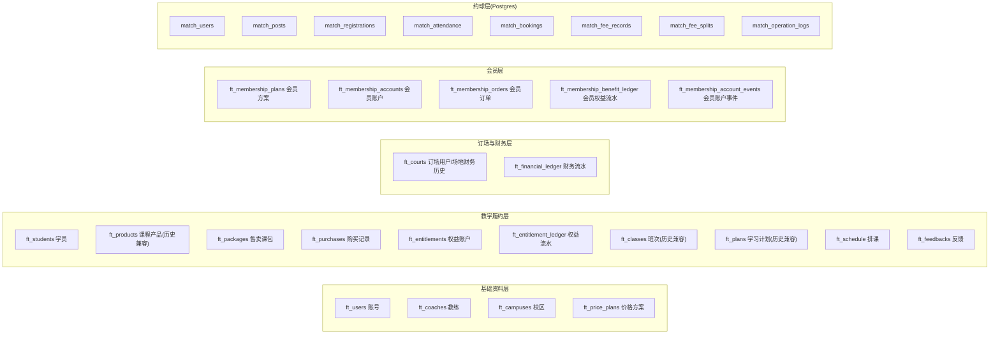
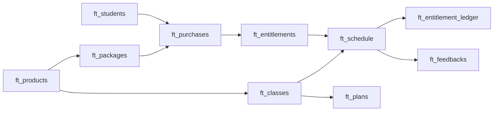
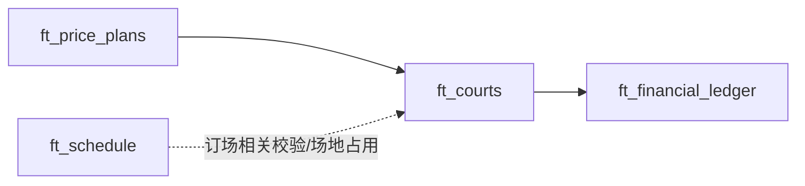
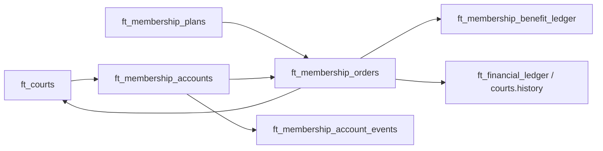
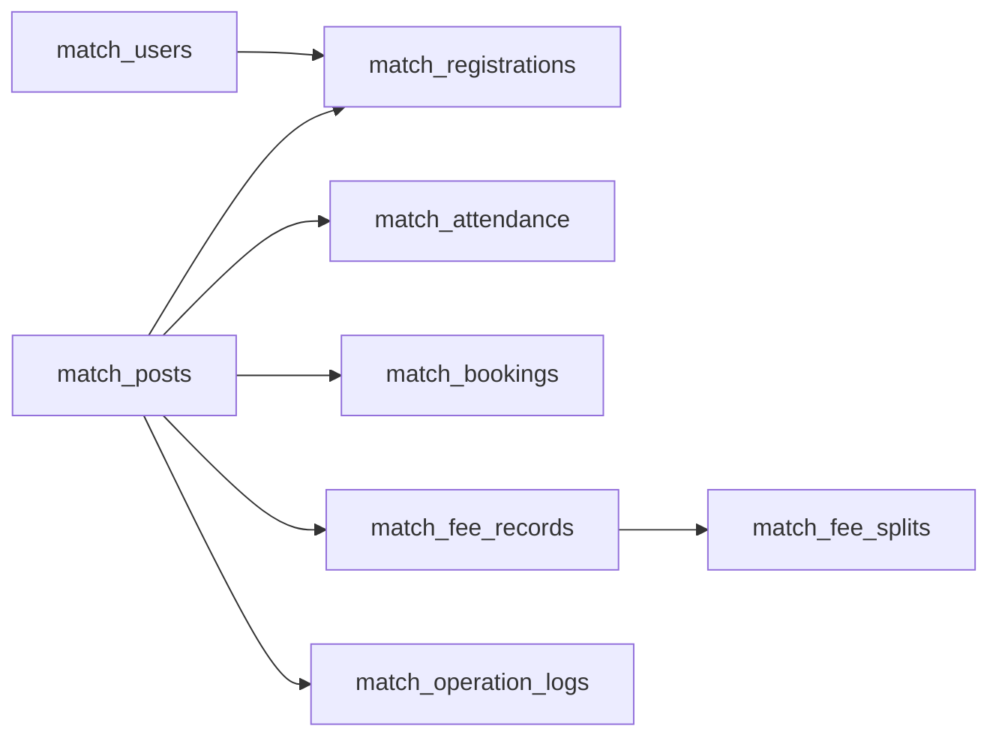
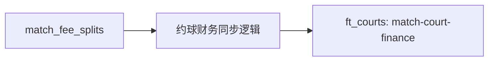
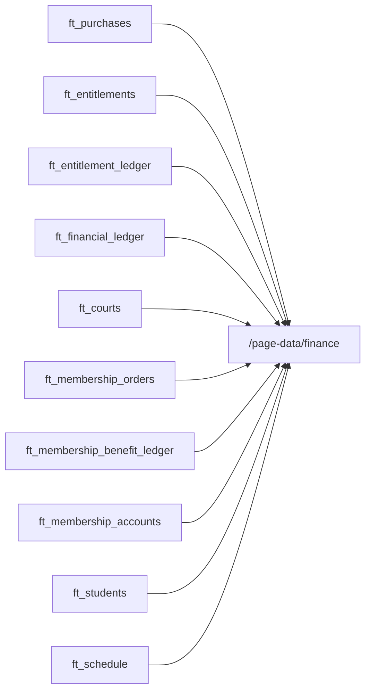
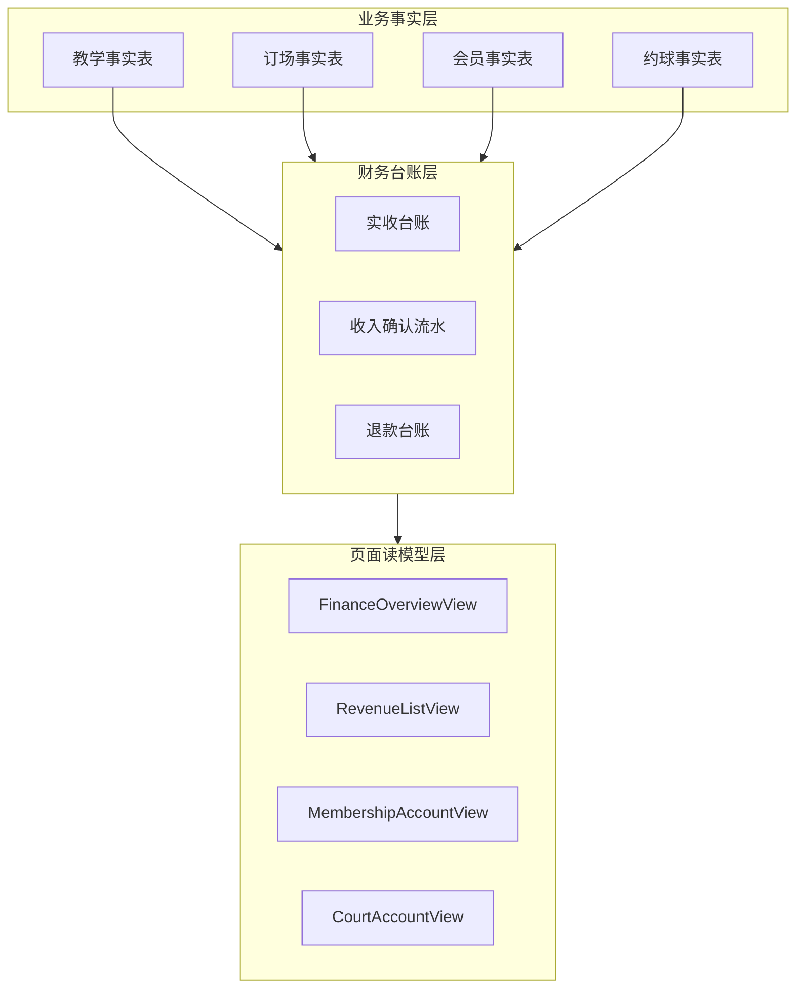

# FlowTennis 核心表关系图

> 版本：2026-05-10  
> 目标：让技术负责人、外部架构师、其他 AI 一眼看懂当前教学、财务、会员、约球之间的主表关系和跨域写入关系。  
> 说明：这份文档不追求数据库范式细节，重点是“真实业务关系”和“风险耦合点”。

---

## 1. 先看结论

FlowTennis 当前不是一条单一业务链，而是 4 套链路缠在一起：

1. 教学售卖履约链
2. 订场 / 场地财务链
3. 会员链
4. 约球链

真正危险的不是“表多”，而是：

- 一个业务域写另一个业务域
- 财务页跨多个业务表拼装
- `courts` 和 `entitlements` 同时承担业务事实 + 财务来源 + 展示聚合底座

---

## 2. 全局分区图

---

## 3. 教学主链

这是当前代码反复强调的“主治理链”。

### 解释

1. 学员买课包，生成 `purchase`
2. `purchase` 自动生成 `entitlement`
3. 排课时从 `entitlement` 扣课
4. 扣课结果写 `entitlement_ledger`
5. 班次 / 学习计划仍在线，但已被定义为历史兼容

### 关键风险

- `purchases` 不是纯销售记录，它会生成 `entitlements`
- `schedule` 不是纯排课，它会改权益余额
- `entitlement_ledger` 不是单纯日志，它会影响余额和财务统计

---

## 4. 订场与场地财务链

### 解释

`ft_courts` 现在不只是订场用户主档，它还承载：

- 订场财务历史 `history`
- 会员充值相关历史
- 约球财务同步账户 `match-court-finance`

这就是一个结构性风险：

**`ft_courts` 既是主档表，又是财务承载体。**

### 关键风险

- 改 `courts` 资料有机会改财务历史
- `courts/migrate-finance-legacy` 会重建旧财务口径
- 财务页会同时读取 `ft_courts` 和 `ft_financial_ledger`

---

## 5. 会员主链

### 解释

会员购买不是只写一张表，而是同时改：

- 会员账户
- 会员订单
- 订场用户主档 / 历史
- 会员权益流水
- 会员账户事件

### 关键风险

- 会员订单与场地财务强耦合
- 会员修复脚本会同时动多个表
- 会员页和财务页共用部分底层来源

---

## 6. 约球主链

### 解释

约球主要在 Postgres，理论上可以是独立子域。

但现实不是完全独立。

---

## 7. 约球反向写入订场财务

这是跨域风险最明显的一条线：

### 含义

约球模块虽然在 Postgres：

- 报名
- 订场
- AA 分摊
- 退款

但一旦分摊状态变化，系统会把结果写进：

- `ft_courts` 里的 `match-court-finance`

### 关键风险

- Postgres 的约球逻辑会影响 TableStore 的财务侧
- 约球 bug 可能污染订场财务口径

---

## 8. 财务页真实依赖图

财务页不是只读“财务台账”，而是读一大包业务表。

### 这张图说明什么

财务页当前是“聚合展示页”，不是“独立财务账本页”。

所以：

- 改购买记录，财务会变
- 改权益流水，财务会变
- 改订场历史，财务会变
- 改会员订单，财务会变

这就是用户反复遇到的“明明没改财务，财务还是坏了”的根因。

---

## 9. 当前最危险的耦合点

下面这些点，技术负责人必须重点盯：

### 9.1 `purchases -> entitlements -> entitlement_ledger -> finance`

这是教学售卖误伤财务的核心链。

### 9.2 `courts` 同时承担主档和财务历史

这是订场域最危险的设计点。

### 9.3 `membership_orders` 同时改会员与场地财务

这是会员误伤财务的核心链。

### 9.4 `match_fee_splits -> match-court-finance`

这是约球跨域污染财务的通道。

### 9.5 `/page-data/finance` 直接拼多表

这是“财务口径不稳”的结构性来源。

---

## 10. 当前缺失但未来 SaaS 必须有的维度

现在这些核心表几乎都缺一个真正的租户主轴：

- `tenantId`
- `clubId`
- `organizationId`

当前主要只有：

- `campus`

但 `campus` 不是租户隔离字段。

### 如果未来做 SaaS，至少这几类表都要补租户维度

#### 业务事实表

- `ft_students`
- `ft_packages`
- `ft_purchases`
- `ft_entitlements`
- `ft_schedule`
- `ft_courts`
- `ft_financial_ledger`
- `ft_membership_*`

#### 配置表

- `ft_coaches`
- `ft_campuses`
- `ft_price_plans`
- `ft_users`

#### 约球表

- `match_*`

---

## 11. 目标态建议图

未来要稳，建议变成下面这种关系：

### 目标态原则

1. 业务事实归业务表
2. 财务口径归财务台账
3. 页面只读读模型
4. 不再让财务页直接拼原始大表

---

## 12. 技术负责人一句话结论

现在真正的问题不是“表太多”，而是：

**多条业务链共享同一批关键表，并且这些关键表同时承担业务事实、财务来源和页面聚合底座。**

只要这个结构不拆，系统就会继续出现：

- 改教学误伤财务
- 改会员误伤订场
- 改约球污染财务
- 改一处坏多处

