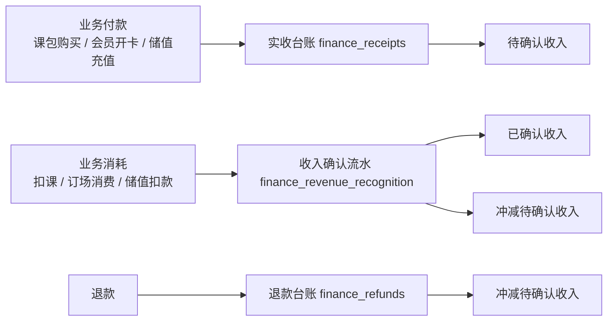

# FlowTennis 财务模块整体架构方案

这份文档不是页面说明。

这份文档要解决的是：

1. FlowTennis 后续财务模块到底按什么口径算
2. 会员、订场、私教课包这几条业务线，怎么统一成一套财务底层逻辑
3. 哪些现有数据能复用，哪些必须新增
4. 月报、季报、退费、收入确认这些能力，系统应该怎么做
5. 哪些地方最容易出错，必须提前锁死规则

这份文档的目标是：

- 给你自己看，能看懂整个财务架构
- 给其他 AI 校对，能准确指出问题
- 给后续开发用，能直接拆成开发任务

---

## 一、先说最终结论

FlowTennis 财务模块第一版，建议统一采用下面 3 个核心口径：

1. `实收金额`
   含义：用户已经实际支付的钱

2. `已确认收入`
   含义：已经随着实际上课、订场、权益消耗而转成收入的钱

3. `待确认收入`
   含义：用户已经付款，但还没有发生实际消耗、暂时不能算收入的钱

三者关系：

```text
待确认收入 = 实收金额 - 已确认收入 - 已退款金额
```

这套口径的意义是：

- 用户买课包 / 买会员当天，不直接算收入
- 只有发生真实消耗时，才确认收入
- 系统既能算“收了多少钱”，也能算“本月真正形成了多少收入”

这正对应你的业务场景：

- 4 月用户付了 50 万
- 但只消耗了 10 万
- 那 4 月财务上真正的收入是 10 万
- 剩下 40 万属于待确认收入

---

## 二、为什么必须单独做财务层

现在 FlowTennis 已经有很多“业务余额”和“业务流水”，但还没有完整的“财务确认层”。

### 目前系统已经有的

1. 课包购买记录 `purchases`
2. 课包余额 `entitlements`
3. 扣课流水 `entitlement_ledger`
4. 订场财务历史 `courts.history`
5. 会员订单 `membership_orders`
6. 会员账户 `membership_accounts`
7. 会员权益流水 `membership_benefit_ledger`

### 目前系统缺的

1. 缺“每一笔付款形成多少待确认收入”的正式财务台账
2. 缺“每次消耗确认了多少收入”的正式收入确认流水
3. 缺“退款冲减了多少待确认收入”的正式退款口径
4. 缺“按月 / 按季度”统一汇总报表
5. 缺“财务口径和业务口径分离”的底层设计

所以结论很明确：

`现有系统有业务流水，但还没有真正的财务结算层。`

后续要做的，不是继续在原来的购买记录、余额页面上硬算，而是：

`在现有业务数据之上，增加一层统一财务台账。`

---

## 三、FlowTennis 财务模块要解决的核心问题

财务模块不是简单算余额。

它必须稳定回答下面 8 个问题：

1. 某个用户一共实际付了多少钱
2. 这些钱里，已经确认成收入了多少
3. 现在还有多少待确认收入
4. 某个月 / 某个季度，一共确认了多少收入
5. 某个用户退款时，理论上最多能退多少
6. 某次退款到底冲减的是哪一笔待确认收入
7. 某次订场 / 某次扣课，到底对应确认了多少收入
8. 财务报表能不能回溯到原始业务记录

如果这 8 个问题答不稳，这套财务模块就不能上线。

---

## 四、整体架构建议

建议把未来财务模块拆成 3 层：

### 1. 业务发生层

也就是现在系统里已经存在的业务对象：

- 课包购买记录 `purchases`
- 扣课流水 `entitlement_ledger`
- 订场财务流水 `courts.history`
- 会员订单 `membership_orders`
- 会员权益流水 `membership_benefit_ledger`

这一层回答的是：

- 发生了什么业务

比如：

- 用户买了一份课包
- 用户订了一次场
- 用户开了一张会员卡
- 用户消耗了一节课

### 2. 财务台账层

这是未来必须新增的财务核心层。

建议新增：

- `finance_receipts` 实收台账
- `finance_revenue_recognition` 收入确认流水
- `finance_refunds` 退款台账
- `finance_balance_snapshot` 可选的财务快照表

这一层回答的是：

- 钱是怎么流动的
- 哪些钱已经变成收入
- 哪些钱还只是待确认收入

### 3. 报表汇总层

基于财务台账层再做：

- 月度收入报表
- 季度收入报表
- 用户级财务卡片
- 导出给代账公司的汇总报表

这一层回答的是：

- 财务要看的结果

---

## 五、推荐的数据模型

这里先给最重要的建议：

`不要直接把“已确认收入”和“待确认收入”写死在业务表里。`

正确做法是：

- 业务表继续保留原职责
- 财务金额通过财务台账流水推导

这样最稳。

---

## 六、建议新增的核心财务表

## 1. `finance_receipts` 实收台账

作用：

- 记录每一笔用户实际付款
- 是后续“待确认收入”的来源

一条记录代表：

- 用户实际支付了一笔钱

典型来源：

- 购买课包
- 会员充值 / 开卡
- 场地储值充值

重要原则：

- `finance_receipts` 只记录“付款事实”
- 不直接存“当前已确认收入”“当前待确认收入”这种派生结果
- 所有当前余额类结果，都应从流水实时计算，避免并发更新导致脏数据

建议字段：

| 字段 | 含义 |
|---|---|
| `id` | 实收台账 ID |
| `userType` | 用户类型：`student` / `court_user` |
| `userId` | 用户 ID |
| `sourceType` | 来源类型：`package_purchase` / `membership_order` / `court_recharge` |
| `sourceId` | 来源业务单 ID |
| `paidAmount` | 实收金额 |
| `bonusAmount` | 赠送金额，仅记录，不计入实收 |
| `paidAt` | 支付时间 |
| `payMethod` | 支付方式 |
| `status` | 状态：`active` / `partially_refunded` / `fully_refunded` / `closed` |
| `notes` | 备注 |
| `createdAt` | 创建时间 |
| `updatedAt` | 更新时间 |

不应该直接存储的字段：

- `recognizedAmount`
- `refundedAmount`
- `remainingDeferredAmount`

这些都应该通过流水实时回算：

```text
recognizedAmount = SUM(finance_revenue_recognition.recognizedAmount WHERE receiptId = ?)
refundedAmount = SUM(finance_refunds.refundAmount WHERE receiptId = ? AND status = 'completed')
remainingDeferredAmount = paidAmount - recognizedAmount - refundedAmount
```

说明：

- 这张表是整个财务模块的源头
- 所有“待确认收入”都从这里来
- 如果后续担心性能，可以增加 `finance_balance_snapshot`
- 但快照表只能用于展示和查询加速，不能作为写入判断依据

---

## 2. `finance_revenue_recognition` 收入确认流水

作用：

- 记录每次业务消耗，确认了多少收入

一条记录代表：

- 某一次上课 / 某一次订场 / 某一次权益消耗
- 从某笔实收中，确认了多少钱收入

建议字段：

| 字段 | 含义 |
|---|---|
| `id` | 收入确认流水 ID |
| `receiptId` | 对应实收台账 ID |
| `userType` | 用户类型 |
| `userId` | 用户 ID |
| `businessType` | 业务类型：`lesson_consumption` / `court_consumption` / `membership_consumption` |
| `businessId` | 对应业务记录 ID |
| `recognizedAmount` | 本次确认收入金额 |
| `recognizedAt` | 确认时间 |
| `recognitionMonth` | 所属月份，例如 `2026-04` |
| `recognitionQuarter` | 所属季度，例如 `2026-Q2` |
| `ruleCode` | 确认规则编码 |
| `reversalOfRecognitionId` | 若为冲销流水，指向原始收入确认流水 |
| `recordType` | `normal` / `reversal` |
| `operator` | 操作人 / system |
| `notes` | 备注 |
| `createdAt` | 创建时间 |

核心规则：

- 每一条收入确认流水，必须能追溯到一条原始业务消耗记录
- 每一条收入确认流水，必须能追溯到一条实收台账
- 同一条业务消耗不能重复确认收入
- 建议在代码层做唯一约束：

```text
businessType + businessId + receiptId + recordType(normal)
```

- 如果需要撤销已确认收入，不删除原记录，而是新增一条 `reversal` 负数冲销流水

这张表是未来：

- 月报
- 季报
- 财务核对

最核心的一张表。

---

## 3. `finance_refunds` 退款台账

作用：

- 记录每次退款到底冲减了哪一笔待确认收入

一条记录代表：

- 某次退费 / 退款动作

建议字段：

| 字段 | 含义 |
|---|---|
| `id` | 退款 ID |
| `receiptId` | 对应实收台账 ID |
| `userType` | 用户类型 |
| `userId` | 用户 ID |
| `sourceType` | 来源类型 |
| `sourceId` | 来源业务单 |
| `refundAmount` | 退款金额 |
| `refundAt` | 退款时间 |
| `approvedBy` | 审批人 |
| `status` | `pending` / `processing` / `completed` / `failed` |
| `refundReason` | 退款原因 |
| `payMethod` | 退款方式 |
| `notes` | 备注 |
| `createdAt` | 创建时间 |

核心规则：

- 退款优先冲减 `remainingDeferredAmount`
- 不能冲减已经确认的收入
- 退款金额必须在后端校验，不能超过：

```text
paidAmount - recognizedAmount - refundedAmount
```

- 退款审批、退款执行、退款完成要区分状态
- 第一版默认不允许退款直接回退已确认收入
- 如果后续确实要回退已确认收入，只能通过单独的红字冲销流水实现

---

## 4. `finance_balance_snapshot` 财务快照表（可选）

作用：

- 加速月报、季报查询
- 做对账快照

第一版不是必须。

如果数据量还不大，可以先不建这张表，报表按流水实时算。

---

## 七、现有业务线如何映射进财务层

这里是最关键的部分。

不是所有业务都一样。

---

## 八、课包业务线的财务逻辑

主链路：

```text
购买课包 -> 生成实收台账 -> 形成待确认收入 -> 排课扣课 -> 确认收入
```

### 1. 用户买课包时

发生两件事：

1. 业务层：
- 生成 `purchases`
- 生成 `entitlements`

2. 财务层：
- 新增一条 `finance_receipts`

示例：

- 学员买 10 节私教课
- 实收 ¥12,000

那系统应写：

- `purchases.amountPaid = 12000`
- `finance_receipts.paidAmount = 12000`
- `recognizedAmount = 0`
- `remainingDeferredAmount = 12000`

### 2. 用户消耗课包时

比如上了 1 节课。

业务层已经有：

- `entitlement_ledger`
- `schedule`

财务层要新增：

- 一条 `finance_revenue_recognition`

### 2.1 课包收入确认触发时机

这是必须锁死的。

课包不能在“排课创建时”确认收入。

第一版建议采用：

`排课状态变为“已结束”且存在反馈记录时，才确认收入`

原因：

1. 排课刚创建时，课程还没真正履约
2. 只按时间结束也不够严谨，因为可能课没真正完成
3. “已结束 + 有反馈”最接近真实履约完成

因此：

- 创建排课：不确认收入
- 修改排课但未结束：不确认收入
- 排课结束且有反馈：确认收入
- 取消排课：不确认收入

如果后续业务希望放宽为“已结束即确认，不等反馈”，必须单独重新评审

### 3. 课包收入确认规则

第一版建议：

`按单节均摊确认收入`

公式：

```text
单节确认金额 = 实收金额 / 总课时
本次确认收入 = 单节确认金额 × 本次消耗课时
```

例子：

- 10 节课包，实收 ¥12,000
- 每节确认收入 = ¥1,200
- 上了 1 节
- 就确认 ¥1,200

### 4. 为什么建议用“按实际付款均摊”

因为第一版最稳。

它有几个优点：

1. 能和业务真实支付对齐
2. 不需要重新维护一套“课包原价 / 标准课时单价 / 活动价”冲突规则
3. 不会出现“用户明明只付了 12,000，系统却累计确认 13,500 收入”的错误

### 5. 课包退款规则

第一版建议：

```text
可退金额 = 实收金额 - 已确认收入 - 已退款金额
```

不能超过这个值。

说明：

- 已经消耗掉、已经确认成收入的部分，不再退
- 退费只退还未消耗部分

### 6. 课包金额精度与尾差规则

这一条必须写死：

1. 金额内部统一按“分”存储
2. 单节均摊金额在内部允许高精度计算
3. 实际落账时，前 N-1 次确认收入统一向下取整到分
4. 最后一笔确认收入自动吃掉全部尾差

例子：

- 10 节课包，实收 10001 分
- 前 9 节每节确认 1000 分
- 最后一节确认 1001 分

这样可以保证：

- 所有确认收入合计 = 实收金额
- 中途退款时也不会出现浮点误差

退款口径：

- 截止退款时，已确认收入以“已经落账的收入确认流水”为准
- 不重新用浮点公式倒算

---

## 九、订场 / 储值业务线的财务逻辑

主链路：

```text
充值储值 -> 生成实收台账 -> 形成待确认收入 -> 订场消费 -> 确认收入
```

### 1. 用户储值时

业务层已经有：

- `courts.history` 中的 `充值`
- 当前余额变化

财务层要新增：

- 一条 `finance_receipts`

示例：

- 订场用户充值 ¥5,000

则：

- `paidAmount = 5000`
- `recognizedAmount = 0`
- `remainingDeferredAmount = 5000`

### 2. 用户订场消费时

业务层已经有：

- `courts.history` 中的 `消费`

财务层要新增：

- 一条 `finance_revenue_recognition`

### 2.1 订场收入确认触发时机

订场和课包不同。

第一版建议：

`以实际扣款完成作为确认收入触发点`

也就是：

- 订场消费写入成功
- 且余额 / 实收扣款成功
- 同时写一条收入确认流水

订场这条线不依赖课后反馈。

### 3. 订场确认收入规则

第一版建议：

`按每次实际消费金额确认收入`

例子：

- 当前余额扣款 ¥300
- 就确认收入 ¥300

这条规则非常稳定，不需要额外复杂计算。

### 4. 订场退款规则

第一版建议：

还是按：

```text
可退金额 = 实收金额 - 已确认收入 - 已退款金额
```

也就是只能退还未消费部分。

---

## 十、会员业务线的财务逻辑

这里要先强调：

`会员资格` 和 `储值金额` 不是完全同一个东西。`

所以会员业务要拆开处理。

### 建议拆成两部分

1. `会员储值部分`
- 例如银卡充 ¥2,000、金卡充 ¥5,000
- 这是钱，走财务台账

2. `会员权益部分`
- 例如赠送公开课、发球机次数、陪打次数
- 这是非现金权益，不直接按现金收入确认

### 1. 会员开卡 / 续充时

业务层已经有：

- `membership_orders`
- `membership_accounts`
- `courts.history` 中的充值

财务层建议：

- 会员储值金额部分，写入 `finance_receipts`

这里要特别区分：

- `paidAmount`：用户真实支付的钱
- `bonusAmount`：系统赠送的钱

示例：

- 用户开卡支付 ¥5,000
- 系统赠送 ¥500

则财务层应写：

- `paidAmount = 5000`
- `bonusAmount = 500`

不能把赠送金额混进实收金额。

### 2. 会员订场 / 储值扣款时

如果本质是余额消费：

- 发生多少消费
- 就确认多少收入

### 3. 会员赠送权益如何处理

第一版建议：

`赠送权益不纳入实收金额，但允许单独记录赠送消耗`

原因：

- 赠送公开课、赠送陪打次数，本质上是赠品权益
- 它们会影响履约成本，但不适合作为第一版的收入确认主口径

第一版建议口径：

1. `paidAmount` 只记用户真实支付金额
2. `bonusAmount` 单独记
3. 用户用赠送余额消费时，可以写收入确认流水，但 `ruleCode = bonus_consumption`
4. 这类记录需要和正常实收消耗区分统计
5. 退款时不退赠送部分，只退真实实收部分

第一版优先把：

- 现金流
- 实收
- 消耗确认收入

先做准。

赠送权益后面可再扩展：

- 统计履约成本
- 做活动赠送分析

---

## 十一、统一的财务主链路

后续整个系统建议统一成这一条：



这一套架构的优点是：

1. 会员和课包都能统一
2. 业务动作和财务动作分层
3. 月报、季报很好算
4. 审计时能追到每一笔来源

---

## 十二、核心财务规则

这部分必须锁死，不然后续一定出错。

### 规则 1：付款不等于收入

- 用户支付后，先进入 `实收金额`
- 同时形成 `待确认收入`
- 不直接进入 `已确认收入`

### 规则 2：只有真实消耗才确认收入

以下动作才允许确认收入：

- 课包发生有效扣课
- 订场发生有效消费
- 余额被真实扣减

### 规则 3：收入确认必须有来源单据

每一条收入确认流水，必须同时关联：

- 一个业务消耗记录
- 一条实收台账

缺一不可。

### 规则 4：退款优先冲减待确认收入

- 已确认收入不在第一版里直接回退
- 退款只退未消耗部分

### 规则 4.1：财务流水默认不可修改、不可删除

必须增加一条总则：

- 所有 `finance_*` 表记录，只允许新增
- 原则上不允许直接修改、删除
- 如果要撤销历史财务动作，必须写一条冲销流水

也就是：

- 错了，不是改旧记录
- 而是新增一条带反向金额的 `reversal` 记录

这是财务可审计的基础。

### 规则 5：任何汇总都不能直接靠页面字段拼

报表必须基于：

- `finance_receipts`
- `finance_revenue_recognition`
- `finance_refunds`

来算。

不能直接从：

- 当前余额
- 课包剩余课时
- 页面展示卡片

去推报表。

### 规则 6：金额字段必须冻结精度

建议：

- 金额统一按“分”存储，前端展示再转元
- 前 N-1 次分摊向下取整
- 尾差统一归入最后一条确认流水

否则月报和季报很容易出现累计误差。

### 规则 7：业务写入和财务写入必须原子完成

凡是会触发财务动作的业务操作，必须在同一个事务里同时完成：

- 业务表写入
- 财务表写入

任何一个失败，全部回滚。

例如：

- 扣课成功但财务没记收入
- 财务记了收入但业务没扣课

这两种都不能接受。

### 规则 8：报表必须跑内部对账等式

每次生成月报、季报时，系统都必须自动校验：

```text
期末待确认收入余额 = 期初待确认收入余额 + 本期实收金额 - 本期已确认收入 - 本期已退款金额
```

如果等式不成立：

- 报表不能标记为“已校验”
- 必须提示财务数据异常

---

## 十三、第一版不建议做的内容

为了避免把事情做爆，第一版先不要做这些：

1. 不做复杂税率计算
2. 不做会计凭证自动生成
3. 不做多币种
4. 不做发票系统联动
5. 不做赠送权益的成本摊销
6. 不做跨笔付款的复杂优先级结转

第一版只要把下面 4 件事做准：

1. 实收记准
2. 消耗确认收入记准
3. 待确认收入算准
4. 月报 / 季报导出准

就已经有非常大价值。

---

## 十四、建议的页面结构

后续建议单独拆一个财务模块，不和当前运营页面混在一起。

建议页面：

### 1. 财务总览

看板指标：

- 本月实收金额
- 本月已确认收入
- 本月退款金额
- 当前待确认收入余额
- 本季度已确认收入

### 2. 财务台账

列表维度：

- 用户
- 来源业务
- 实收金额
- 已确认收入
- 已退款
- 待确认收入
- 状态

### 3. 收入确认流水

列表维度：

- 用户
- 消耗类型
- 来源记录
- 本次确认收入
- 确认时间
- 月份 / 季度

### 4. 退款台账

列表维度：

- 用户
- 退款金额
- 冲减哪笔实收
- 退款时间
- 退款原因
- 审批人
- 状态

### 5. 财务报表导出

导出维度：

- 月报
- 季报
- 用户级明细

---

## 十五、建议的报表内容

## 1. 月报

字段建议：

| 字段 | 说明 |
|---|---|
| 月份 | 例如 2026-04 |
| 月内实收金额 | 本月收到的钱 |
| 月内已确认收入 | 本月因消耗形成的收入 |
| 月内退款金额 | 本月退款 |
| 月末待确认收入余额 | 截至月末未消耗部分 |
| 对账结果 | 期初 + 本期实收 - 本期确认 - 本期退款 = 期末 是否成立 |

## 2. 季报

字段建议：

| 字段 | 说明 |
|---|---|
| 季度 | 例如 2026-Q2 |
| 季内实收金额 | 该季度累计收款 |
| 季内已确认收入 | 该季度累计确认收入 |
| 季内退款金额 | 该季度累计退款 |
| 季末待确认收入余额 | 截至季末剩余待确认金额 |
| 对账结果 | 季度内部等式是否成立 |

## 3. 用户财务明细

字段建议：

| 字段 | 说明 |
|---|---|
| 用户姓名 | 用户 |
| 实收金额累计 | 总付费 |
| 已确认收入累计 | 已消耗转收入 |
| 已退款累计 | 已退回 |
| 待确认收入余额 | 尚未消耗 |

---

## 十六、取消 / 作废 / 冲销场景

这部分是财务模块必须提前定义的。

### 1. 取消排课

第一版建议：

- 未到“已结束 + 有反馈”之前取消排课：不触发财务动作
- 如果已经确认收入后又要撤销：不删原收入确认记录
- 而是新增一条 `reversal` 类型的负数冲销流水

### 2. 作废购买记录

第一版建议：

- 如果尚未产生任何收入确认流水，可以作废，并关闭对应实收台账
- 如果已经有收入确认流水，不直接删除历史记录
- 需要单独走“退款 / 冲销”逻辑

### 3. 退款

- 退款不改历史实收记录
- 退款新增一条退款台账
- 如需回退已确认收入，必须新增单独冲销流水，不能直接改旧流水

---

## 十七、财务启用日与历史迁移

这一部分必须单独定义，不能留白。

第一版建议：

1. 设一个明确的 `财务启用日`
2. 启用日之后：
   - 所有新业务严格按新财务口径写入
3. 启用日之前：
   - 不默认自动补算全部历史确认收入
   - 但要把“仍然有效、后续还会继续消耗 / 退款”的历史付款补成 `finance_receipts`

也就是：

- 旧的历史课包，如果还没消耗完，必须补一条实收台账
- 旧的会员储值，如果余额还存在，也必须补一条实收台账
- 启用日前的历史已消耗是否补收入确认流水，要单独出一次迁移决策

第一版建议保守处理：

- 报表从财务启用日开始正式可信
- 启用日前是否补算，作为一次单独历史迁移项目，不和第一版混做

---

## 十八、现有系统哪些能复用，哪些必须新增

---

## 可以复用的

1. 课包购买记录 `purchases`
2. 课包消耗流水 `entitlement_ledger`
3. 订场财务流水 `courts.history`
4. 会员订单 `membership_orders`
5. 用户、学员、订场用户等主体信息

## 必须新增的

1. 实收台账 `finance_receipts`
2. 收入确认流水 `finance_revenue_recognition`
3. 退款台账 `finance_refunds`
4. 月报 / 季报导出逻辑
5. 财务总览页

## 不建议直接复用为财务主口径的

1. `entitlements.remainingLessons`
   这是课时余额，不是金额余额

2. `courts.balance`
   这是业务余额，不是完整财务待确认收入余额

3. 页面上的统计卡片
   这些是展示结果，不是审计级数据源

---

## 十九、最容易出错的地方

这部分是最重要的风险清单。

### 1. 把“实收”和“收入”混掉

这是最大的风险。

必须始终分开：

- 收到多少钱
- 本期确认多少收入

### 2. 课包金额分摊规则不一致

比如有些地方按原价，有些地方按实收，有些地方按优惠后金额。

第一版必须锁死：

`课包收入确认统一按实际付款金额均摊`

### 3. 退款把已确认收入也减掉

第一版不要这么做。

否则财务逻辑会复杂很多，月报会变得难以对账。

### 4. 一个消耗动作重复确认收入

比如：

- 排课保存确认一次
- 编辑状态又确认一次

必须防重。

建议：

- 每条业务消耗最多生成一组唯一收入确认流水
- 用 `businessType + businessId + receiptId + recordType(normal)` 做唯一约束

### 5. 一个业务消耗找不到对应实收来源

比如：

- 用户消耗了课时
- 但找不到来自哪笔课包购买

这种情况必须禁止进入收入确认。

### 6. 金额精度误差

课包均摊最容易出小数误差。

建议：

- 统一用分
- 均摊时保留内部高精度
- 实际落账前 N-1 次向下取整
- 最后一节课做尾差归集

### 7. 历史数据补算口径混乱

如果后续要把旧数据迁入财务模块：

- 必须明确历史起算日
- 不要默认把所有旧业务直接认成正确财务口径

建议：

- 第一版先设一个财务启用日期
- 启用日期之后的数据严格按新财务逻辑跑
- 启用日期之前如需补算，做单独迁移方案

### 8. 业务流水和财务流水没做原子事务

这是严重风险。

必须保证：

- 业务成功 = 财务成功
- 财务失败 = 业务回滚

### 9. 赠送金额混入实收金额

如果把 bonus 直接算进实收：

- 实收口径会从第一天就错
- 报税和对账都会歪

### 10. 报表没有自动对账

如果月报 / 季报只出数字，不跑自检等式：

- 出错时不会第一时间被发现

---

## 二十、建议的开发顺序

### 第一阶段：先把底层账建起来

做这些：

1. 新增 `finance_receipts`
2. 新增 `finance_revenue_recognition`
3. 新增 `finance_refunds`
4. 打通原子事务：
   - 课包购买 -> 实收台账
   - 储值充值 -> 实收台账
   - 会员开卡 -> 实收台账
   - 消耗 -> 收入确认流水

### 第二阶段：把计算规则跑通

做这些：

1. 课包按实收均摊收入
2. 订场按实际消费确认收入
3. 退款自动计算最大可退金额
4. 待确认收入自动回算
5. 红字冲销机制
6. 报表自动对账等式

### 第三阶段：做财务页面

做这些：

1. 财务总览
2. 财务台账
3. 收入确认流水
4. 退款台账
5. 月报 / 季报导出

---

## 二十一、建议的校对重点

你后面发给其他 AI 校对时，建议重点让它们校对这 10 个问题：

1. `待确认收入 = 实收金额 - 已确认收入 - 已退款金额` 是否一致
2. 课包收入确认按“实收均摊”是否合理
3. 订场收入确认按“实际消费金额”是否合理
4. 退款是否只冲减待确认收入
5. 是否需要支持已确认收入的反向冲销
6. 一个业务消耗是否会重复确认收入
7. 是否需要“最后一节课尾差归集”
8. 会员赠送权益是否暂时排除在现金收入主链之外
9. 老数据是否要设启用日期
10. 报表是否足够覆盖代账公司需要的字段

---

## 二十二、待业务 / 财务确认问题清单

下面这些问题，建议你单独拿给业务或财务确认。

### 1. 课包收入确认触发点

当前建议：

- `排课状态 = 已结束`
- 且 `已有反馈记录`

待确认：

- 是否必须等反馈
- 还是“课程结束即确认”就可以

### 2. 赠送金额的口径

当前建议：

- `paidAmount` 只记用户真实付款
- `bonusAmount` 单独记录
- 赠送余额消费单独标记 `bonus_consumption`
- 赠送部分不退款

待确认：

- 赠送余额消费是否进入“已确认收入”主报表
- 还是只进入附表，不进入主收入口径

### 3. 已确认收入是否允许后续冲销

当前建议：

- 第一版默认不直接回退
- 如需回退，只能用红字冲销

待确认：

- 业务是否存在必须撤回已确认收入的场景
- 如果有，审批权限归谁

### 4. 财务启用日前的历史数据怎么处理

当前建议：

- 启用日后严格按新口径
- 启用日前的实收补台账
- 启用日前的历史确认收入先不全量补算

待确认：

- 代账公司是否要求季度报表覆盖启用日前历史
- 如果要求，必须单独做历史迁移方案

### 5. 退款审批流

当前建议：

- 退款必须记录 `approvedBy`
- 状态至少有 `pending / processing / completed / failed`

待确认：

- 第一版是否真的需要两级审批
- 还是只记录操作人和审批人即可

### 6. 报表展示口径

当前建议：

- 主报表展示：
  - 实收金额
  - 已确认收入
  - 已退款
  - 待确认收入

待确认：

- 是否还要单独加一列“赠送消耗金额”
- 是否要把赠送消耗排除在主收入口径之外

---

## 二十三、最终结论

FlowTennis 财务模块第一版，建议采用下面这套统一架构：

### 财务主口径

- `实收金额`
- `已确认收入`
- `待确认收入`

### 财务主原则

- 付款不等于收入
- 只有真实消耗才确认收入
- 退款优先冲减待确认收入
- 财务报表只基于财务台账，不直接基于页面展示字段

### 财务主模型

- `finance_receipts`
- `finance_revenue_recognition`
- `finance_refunds`

### 实施策略

- 先补底层财务台账
- 再补确认收入规则
- 最后做财务页面和报表

一句话总结：

`现有系统已经有业务数据基础，但还没有正式财务层；后续应该把“业务发生”和“财务确认”拆开，单独建立可审计的财务台账体系。`
