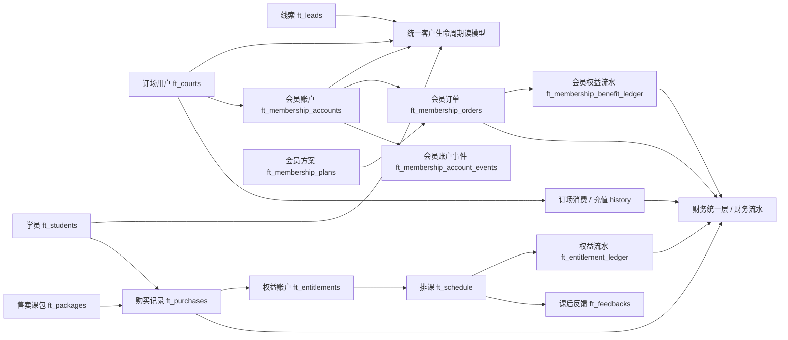

# 全平台业务对象

> 版本：2026-07-02
> 状态：重写版 PRD 模块
> 定位：定义 FlowTennis 全平台核心业务对象、字段、状态、关系和复原边界。本文档用于让交接方先建立完整对象地图，再进入页面需求和数据模型细节。

## PRD 内部引用

> 本文为 PRD 正本内容，复刻系统时只允许引用 PRD 目录内文件；旧 `docs/` 文档仅作为历史迁移来源，不作为交付依赖。

- 00-项目总览.md
- 04-功能清单.md
- 05-全平台数据口径.md
- 06-字段与状态规则.md
- 08-具体需求/
- 09-数据模型与表关系/
- 10-异常场景与安全红线.md
- 11-验收标准与测试门禁.md

## 1. 对象设计原则

FlowTennis 不是“一个页面一张表”的系统，而是“事实对象 + 统一读模型 + 多页面展示”的系统。

核心原则：

1. 客户是统一自然人，不等于线索、学员、订场用户或会员账户中的任意一个单表。
2. 教学售卖主链路是 `课包 -> 购买 -> 权益 -> 排课 -> 权益流水`。
3. 场地会员主链路是 `订场用户 -> 会员账户 -> 会员订单 -> 会员权益流水 -> 账户事件`。
4. 财务对象不由页面临时重算，必须来自财务统一层、财务快照或标准流水。
5. 历史兼容对象可以保留，但不能继续扩散成新功能的主事实源。
6. 删除、作废、退款、合并、清零等动作必须保留追溯字段，不能只做物理删除。

## 2. 全平台对象总览

| 业务域 | 对象 | 表 / 读模型 | 主键 | 主要页面 | 说明 |
|---|---|---|---|---|---|
| 客户生命周期 | 统一客户 | `customer-lifecycle` 读模型 | `customerId/sourceLeadId` 等组合识别 | 线索池、普通学员、正式学员、订场用户、会员管理、经营分析 | 跨线索、学员、订场、会员识别同一人 |
| 线索 | 线索 | `ft_leads` | `id` | 线索池、转化与留存 | 跟进链路入口 |
| 线索 | 跟进记录 | `ft_lead_followups` | `id` | 线索详情 | 记录每次跟进动作 |
| 线索 | 导入批次 | `ft_lead_import_batches` | `id` | 线索导入 | 线索批量导入追溯 |
| 教学 | 学员 | `ft_students` | `id` | 普通学员、正式学员、排课、购买 | 教学系统里的上课对象 |
| 教学商品 | 课程产品 | `ft_products` | `id` | 课程产品 | 历史兼容课程模板 |
| 教学商品 | 售卖课包 | `ft_packages` | `id` | 课包产品、购买 | 当前教学售卖主商品 |
| 教学交易 | 购买记录 | `ft_purchases` | `id` | 正式学员、课包购买、财务 | 买了什么、付了多少钱 |
| 教学履约 | 权益账户 | `ft_entitlements` | `id` | 课包余额、排课、正式学员 | 还剩什么、怎么用 |
| 教学履约 | 权益流水 | `ft_entitlement_ledger` | `id` | 消课记录、财务入账 | 课时为什么增减 |
| 教学组织 | 班次 | `ft_classes` | `id` | 班次管理、排课 | 历史兼容长期班级 |
| 教学组织 | 学习计划 | `ft_plans` | `id` | 学习计划 | 班次自动生成的计划 |
| 教学发生 | 排课 | `ft_schedule` | `id` | 排课管理、排课日历、教练端 | 具体一节课 |
| 教学反馈 | 课后反馈 | `ft_feedbacks` | `id` | 教练工作台、教练小程序、运营跟进 | 教练对课后情况的记录 |
| 教学反馈 | 教练提案 / 教案 | `ft_coach_proposals` | `id` | 教练端、教练人效 | 教练提交的课前 / 课后建议 |
| 场地 | 订场用户 | `ft_courts` | `id` | 订场用户、会员管理、财务 | 场地客户主表 |
| 会员商品 | 会员方案 | `ft_membership_plans` | `id` | 会员方案 | 储值和赠送权益规则 |
| 会员账户 | 会员账户 | `ft_membership_accounts` | `id` | 会员管理 | 某客户当前储值账户 |
| 会员交易 | 会员订单 | `ft_membership_orders` | `id` | 会员订单、财务 | 开卡、续充、充值事实 |
| 会员权益 | 会员权益流水 | `ft_membership_benefit_ledger` | `id` | 会员详情 | 赠送、消耗、补发、调整 |
| 会员事件 | 会员账户事件 | `ft_membership_account_events` | `id` | 会员审计 | 自动延长、清零、作废等事件 |
| 财务 | 标准财务流水 | `ft_financial_ledger` | `id` | 财务总览、收款流水、入账流水 | 标准财务事实或兼容流水 |
| 基础资料 | 教练 | `ft_coaches` | `id` | 教练管理、排课、教练端 | 教练业务身份 |
| 基础资料 | 校区 | `ft_campuses` | `id` | 校区管理、所有筛选 | 校区标准来源 |
| 基础资料 | 账号 | `ft_users` | `id` | 账号管理、登录 | 登录与权限主体 |
| 基础资料 | 价格方案 | `ft_price_plans` | `id` | 基础设置、订场 / 渠道价格 | 场地价、渠道商品价 |
| 约球 | 约球活动 | Postgres `match_posts` | `id` | 约球小程序、约球管理 | 用户约球活动 |
| 约球 | 报名记录 | Postgres `match_registrations` | `id` | 约球活动详情 | 用户报名和取消 |
| 约球 | 费用分摊 | Postgres `match_fee_splits` | `id` | 约球财务 | AA 应收、实收、退款 |
| 约球 | 操作日志 | Postgres `match_operation_logs` | `id` | 约球审计 | 活动和财务变更记录 |

## 3. 对象关系总图

## 4. 客户生命周期对象

客户生命周期对象不是单表，而是统一读模型。它负责把线索、学员、订场用户、会员账户串成“同一个真实客户”。

### 4.1 关键字段

| 字段 | 含义 | 取值来源 |
|---|---|---|
| `customerId` | 统一客户 ID | 已合并客户档案、手机号、微信、会员账户等规则推导 |
| `sourceLeadId` | 标准线索来源 ID | `lead.id`，兼容 `leadId/fromLeadId` |
| `displayName` | 姓名 | 线索、学员、订场用户、会员账户中优先级最高的姓名 |
| `phone` | 手机号 | 标准化手机号 |
| `source` | 来源 | 线索来源、导入来源或历史来源 |
| `campus` | 客户归属校区 | 线索、学员、订场、会员、排课综合推导 |
| `owner` | 负责人 | 线索跟进人、学员负责人或运营归属 |
| `leadStage` | 线索阶段 | 新线索、跟进中、已约体验、已体验待成交、已成交、已流失等 |
| `studentStage` | 学员阶段 | 普通学员、正式学员等 |
| `courtStage` | 订场阶段 | 订场用户、持续订场、会员订场等 |
| `membershipStatus` | 会员状态 | 会员账户状态 |
| `dealType` | 成交类型 | 课程、订场、订场会员及组合 |

### 4.2 使用规则

1. 线索池、普通学员、正式学员、订场用户、会员管理必须读统一客户生命周期。
2. 普通学员和正式学员是同一个客户的不同当前视图，不是两张独立自然人表。
3. 订场用户和会员管理也不能被当成独立客户表。
4. 姓名不能作为唯一识别依据。
5. 手机号冲突、微信冲突、人工合并冲突必须进入异常处理，不得自动乱合并。

## 5. 线索对象

### 5.1 线索 `ft_leads`

| 字段 | 含义 | 必填 | 说明 |
|---|---|---|---|
| `id` | 线索 ID | 是 | 主键 |
| `displayName/name/wechatName` | 姓名 / 微信名 | 至少一个 | 页面统一展示为“姓名” |
| `phone` | 手机号 | 推荐必填 | 用于客户识别、去重 |
| `source` | 来源 | 否 | 标准来源字典 |
| `campus` | 校区 | 否 | 分配或归属校区 |
| `customerType` | 客户类型 | 否 | 成人、青少年等 |
| `demandProduct/consultType` | 需求产品 | 否 | 历史 `consultType` 只能兼容映射 |
| `leadStage/systemStatus` | 线索阶段 | 是 | 当前推进状态 |
| `intentLevel` | 意向等级 | 否 | 运营判断 |
| `owner` | 跟进人 | 否 | 负责运营 |
| `nextFollowupAt` | 下次跟进时间 | 否 | 待办筛选 |
| `studentId` | 关联学员 | 否 | 转入教学后写入 |
| `courtId` | 关联订场用户 | 否 | 转入订场后写入 |
| `membershipAccountId` | 关联会员账户 | 否 | 转入会员后写入 |
| `dealType/conversionType` | 成交类型 | 否 | 历史 `conversionType` 兼容映射 |
| `lostReason` | 流失原因 | 否 | 流失阶段必填 |
| `createdAt/updatedAt` | 时间 | 是 | 审计 |

状态规则：

| 阶段 | 含义 | 下游影响 |
|---|---|---|
| 新线索 | 刚进入线索池 | 进入有效线索统计 |
| 跟进中 | 已有人跟进 | 产生跟进记录 |
| 已约体验 | 已安排体验课 | 进入体验预约统计 |
| 已体验待成交 | 已上体验课但未成交 | 进入待转化 |
| 已成交 | 课程 / 订场 / 会员任一成交 | 进入成交统计 |
| 已流失 | 明确不继续 | 需要流失原因 |
| 无效 / 重复 / 测试 / 误录 | 不进入有效线索 | 从漏斗分母排除 |

### 5.2 跟进记录 `ft_lead_followups`

| 字段 | 含义 |
|---|---|
| `id` | 跟进记录 ID |
| `leadId` | 所属线索 |
| `content/conclusion` | 跟进内容和结论 |
| `nextAction` | 下一步动作 |
| `nextFollowupAt` | 下次跟进时间 |
| `operator` | 操作人 |
| `createdAt` | 跟进时间 |

规则：

1. 跟进记录只能归属于一个线索。
2. 新增跟进后，需要同步线索的最近跟进摘要和下次跟进时间。
3. 校区管理员只能看和写授权校区线索的跟进记录。

## 6. 教学对象

### 6.1 学员 `ft_students`

学员是教学系统里的上课对象，不等同于统一客户。

| 字段 | 含义 | 影响 |
|---|---|---|
| `id` | 学员 ID | 购买、权益、班次、计划、排课、反馈主关联 |
| `name` | 姓名 | 同步到购买、权益、排课、反馈展示 |
| `phone` | 手机号 | 客户识别、查重 |
| `type` | 学员类型 | 筛选、分层 |
| `campus` | 所属校区 | 校区权限、筛选、经营分析 |
| `source` | 来源 | 转化分析 |
| `sourceLeadId` | 来源线索 | 客户生命周期串联 |
| `notes` | 备注 | 运营查看 |
| `createdAt/updatedAt` | 时间 | 审计 |

删除 / 作废规则：

1. 已有关联购买、权益、排课、反馈、计划、班次、订场用户时，不应物理删除。
2. 改姓名 / 手机号时，需要同步历史展示快照或保留旧快照追溯。
3. 学员转正式不靠手填状态，必须由购买 / 权益 / 排课等事实推导。

### 6.2 售卖课包 `ft_packages`

课包是当前教学售卖主商品。

| 字段 | 含义 |
|---|---|
| `id` | 课包 ID |
| `name` | 课包名称 |
| `productId/productName` | 关联课程产品及名称快照 |
| `courseType` | 课程类型 |
| `price` | 售价 |
| `lessons` | 课时 |
| `validDays` | 有效天数 |
| `saleStartDate/saleEndDate` | 售卖期 |
| `usageStartDate/usageEndDate` | 可用期 |
| `dailyTimeWindows` | 每日可用时段 |
| `timeBand` | 时段类型 |
| `coachIds/coachNames` | 可用教练 |
| `campusIds` | 可用校区 |
| `maxStudents` | 适用人数上限 |
| `status` | `active/inactive/merged` 等 |

规则：

1. 已售课包的核心规则必须作为购买和权益快照保存。
2. 后续修改课包，不应改变历史购买记录的含义。
3. 课包合并时，源课包应标记 `merged`，并更新关联购买、权益和排课展示追溯。
4. `status=inactive` 表示停售，不代表历史购买无效。

### 6.3 购买记录 `ft_purchases`

购买记录回答“谁买了什么，付了多少钱”。

| 字段 | 含义 |
|---|---|
| `id` | 购买 ID |
| `studentId/studentName/studentPhone` | 学员及快照 |
| `packageId/packageName` | 课包及快照 |
| `productId/productName/courseType` | 课程来源快照 |
| `packageLessons/packagePrice` | 课时和原价快照 |
| `amountPaid` | 实收金额 |
| `payMethod` | 支付方式 |
| `purchaseDate` | 购买日期 |
| `operator` | 操作人 |
| `status` | `active/voided/refunded` 等 |
| `voidedAt/voidedBy/voidReason` | 作废追溯 |

规则：

1. 新增购买后自动生成权益账户。
2. 如果已经有消课流水，购买记录核心字段不能随意修改。
3. 作废购买必须同步作废关联权益，并写权益流水追溯。
4. 购买金额进入收款和待履约财务口径，不能由页面临时解释。

### 6.4 权益账户 `ft_entitlements`

权益账户回答“这名学员还剩多少课、能在什么规则下使用”。

| 字段 | 含义 |
|---|---|
| `id` | 权益 ID |
| `studentId/studentName` | 学员及快照 |
| `purchaseId` | 来源购买 |
| `packageId/packageName` | 来源课包 |
| `courseType` | 课程类型 |
| `totalLessons` | 总课时 |
| `usedLessons` | 已用课时 |
| `remainingLessons` | 剩余课时 |
| `validFrom/validUntil` | 有效期 |
| `usageStartDate/usageEndDate` | 可用日期范围 |
| `dailyTimeWindows/timeBand` | 可用时段 |
| `coachIds/coachNames` | 可用教练 |
| `campusIds` | 可用校区 |
| `maxStudents` | 人数限制 |
| `status` | `active/depleted/expired/voided` 等 |

规则：

1. `usedLessons/remainingLessons/status` 是系统结果，不应页面手填。
2. 排课使用权益时必须校验课程类型、学员、课时余额、有效期、时段、教练、校区、人数上限。
3. 权益作废、调整、消课、退课都必须有权益流水。

### 6.5 权益流水 `ft_entitlement_ledger`

权益流水回答“课时为什么变化”。

| 字段 | 含义 |
|---|---|
| `id` | 流水 ID |
| `entitlementId` | 权益 ID |
| `purchaseId` | 来源购买 |
| `studentId` | 学员 |
| `scheduleId` | 对应排课 |
| `lessonDelta` | 课时变化，扣课为负数 |
| `action` | `consume/void_purchase/manual_adjust` 等 |
| `reason` | 原因 |
| `operator` | 操作人 |
| `createdAt` | 创建时间 |

规则：

1. 排课消课写负数流水。
2. 作废购买写作废追溯流水。
3. 手工调整是高风险动作，必须记录操作人和原因。

### 6.6 排课 `ft_schedule`

排课是一节真实或计划发生的课程。

| 字段 | 含义 |
|---|---|
| `id` | 排课 ID |
| `classId` | 班次 ID，可为空 |
| `studentId/studentIds/studentName` | 上课学员 |
| `entitlementId/entitlementIds` | 使用权益 |
| `startTime/endTime` | 上课时间 |
| `coach/coachId` | 教练 |
| `campus` | 校区 |
| `venue/venueId` | 场地 |
| `courseType` | 课程类型 |
| `lessonCount` | 本节扣几节 |
| `status` | `已排课/已结束/已取消` 等 |
| `cancelReason` | 取消原因 |
| `notifyStatus` | 通知状态 |
| `confirmStatus` | 确认状态 |
| `scheduleSource` | 来源 |
| `createdBy/createdAt/updatedAt` | 审计 |

规则：

1. `已取消` 不应扣课。
2. 到时间后的 `已结束` 可由系统根据时间推导。
3. 取消已消课排课时，必须回退权益和相关储值消费。
4. 教练端只显示当前教练相关排课。

### 6.7 课后反馈 `ft_feedbacks`

| 字段 | 含义 |
|---|---|
| `id` | 反馈 ID |
| `scheduleId` | 对应排课 |
| `studentId/studentIds/studentName` | 学员快照 |
| `coach` | 教练 |
| `startTime/campus/venue/lessonCount` | 课程快照 |
| `isTrial` | 是否体验课 |
| `knowledgePoint` | 知识点 / 问题 |
| `nextTraining` | 下次训练建议 |
| `playerLevel/goalType/mainIssues` | 学员水平与问题 |
| `conversionIntent` | 转化意向 |
| `recommendedProductType` | 推荐产品 |
| `needOpsFollowUp` | 是否需要运营跟进 |
| `opsFollowUpPriority` | 跟进优先级 |
| `opsFollowUpSuggestion` | 跟进建议 |

规则：

1. 反馈必须绑定排课。
2. 教练只能给本人课程提交反馈。
3. 反馈会影响教练反馈完成率、运营跟进和体验转化分析。

## 7. 场地与会员对象

### 7.1 订场用户 `ft_courts`

| 字段 | 含义 |
|---|---|
| `id` | 订场用户 ID |
| `name` | 姓名 |
| `phone` | 手机号 |
| `campus` | 校区 |
| `studentId/studentIds` | 关联教学学员 |
| `history` | 订场、充值、消费等历史数组 |
| `balance` | 当前余额 |
| `totalDeposit` | 累计充值 |
| `spentAmount` | 累计消费 |
| `recentFollowUpDate/nextFollowUpDate` | 跟进 |
| `status` | `active/inactive` 等 |
| `mergedIntoCourtId` | 合并目标 |
| `deletedAt` | 删除 / 隐藏时间 |

规则：

1. `history` 是场地和会员财务关键来源，不能随意删改。
2. 合并订场用户时，源用户标记 `inactive` 并写 `mergedIntoCourtId`。
3. 订场用户隐藏 / 删除不等于删除历史财务事实。

### 7.2 会员方案 `ft_membership_plans`

| 字段 | 含义 |
|---|---|
| `id` | 方案 ID |
| `name/tierCode` | 方案名称 / 档位 |
| `rechargeAmount` | 充值金额 |
| `bonusAmount` | 赠送金额 |
| `discountRate` | 折扣 |
| `saleStartDate/saleEndDate` | 售卖期 |
| `status` | `draft/active/inactive` 等 |
| `benefitTemplate` | 结构化权益模板 |
| `publicLessonCount/stringingLaborCount/ballMachineCount/...` | 权益次数 |
| `designatedCoachIds` | 指定教练权益 |

规则：

1. 上架方案可被会员订单引用。
2. 订单必须保存方案快照，避免后续改方案影响历史订单。
3. 充值金额是财务收入，赠送金额 / 赠送权益不是实收。

### 7.3 会员账户 `ft_membership_accounts`

| 字段 | 含义 |
|---|---|
| `id` | 会员账户 ID |
| `courtId` | 订场用户 ID |
| `courtName/phone` | 客户快照 |
| `studentIds` | 关联教学学员 |
| `status` | `active/extended/cleared/voided` |
| `memberTag/memberLabel` | 档位标签 |
| `discountRate` | 当前折扣 |
| `cycleStartDate` | 周期开始 |
| `validUntil` | 有效期 |
| `hardExpireAt` | 最晚清零日 |
| `autoExtended` | 是否已自动延长 |
| `lastQualifiedRechargeAmount` | 最近一次符合重置条件的充值 |
| `lastOrderId` | 最近订单 |

状态含义：

| 状态 | 含义 |
|---|---|
| `active` | 正常会员期 |
| `extended` | 有余额且进入延续期 |
| `cleared` | 到期余额已清零 |
| `voided` | 账户作废 |

规则：

1. 新会员订单会创建或更新会员账户。
2. 到期但仍有余额时，可自动延长到 `hardExpireAt`。
3. 超过最晚清零日且有余额时，应写自动清零事件。

### 7.4 会员订单 `ft_membership_orders`

| 字段 | 含义 |
|---|---|
| `id` | 订单 ID |
| `membershipAccountId` | 会员账户 |
| `courtId/courtName` | 订场用户快照 |
| `membershipPlanId/membershipPlanName` | 方案及快照 |
| `rechargeAmount` | 实收充值金额 |
| `bonusAmount` | 赠送金额 |
| `discountRate` | 折扣 |
| `purchaseDate/effectiveDate` | 购买 / 生效日期 |
| `cycleStartDate/validUntil/hardExpireAt` | 周期规则 |
| `qualifiesRenewalReset` | 是否重置有效期 |
| `planBenefitTemplateSnapshot` | 方案权益快照 |
| `benefitSnapshot` | 本次权益快照 |
| `benefitValidUntil` | 权益有效期 |
| `status` | `active/voided/refunded` |

规则：

1. 订单创建时更新会员账户。
2. 订单创建时写订场用户 `history`。
3. 订单创建时写赠送权益流水。
4. 订单作废 / 退款是财务高风险动作，必须追溯。

### 7.5 会员权益流水 `ft_membership_benefit_ledger`

| 字段 | 含义 |
|---|---|
| `id` | 流水 ID |
| `membershipAccountId` | 会员账户 |
| `courtId` | 订场用户 |
| `membershipOrderRef` | 来源订单 |
| `benefitType` | 权益类型 |
| `action` | `grant/consume/supplement/adjust/void` |
| `delta` | 次数或金额变化 |
| `operator` | 操作人 |
| `reason` | 原因 |
| `createdAt` | 时间 |

规则：

1. 订单赠送写 `grant`。
2. 消费权益写 `consume`。
3. 补发和调整必须写 `supplement/adjust`。
4. 作废必须写 `void`，不能直接删流水。

## 8. 财务对象

### 8.1 标准财务流水 `ft_financial_ledger`

| 字段 | 含义 |
|---|---|
| `id` | 财务流水 ID |
| `transactionTime` | 交易时间 |
| `transactionType` | 交易类型 |
| `businessType` | 业务类型 |
| `incomeType` | 收入类型 |
| `payMethod` | 支付方式 |
| `receivableAmount` | 应收 |
| `actualReceivedAmount/cashDelta` | 实收变化 |
| `recognizedRevenueDelta` | 入账变化 |
| `pendingRevenueDelta` | 待履约变化 |
| `studentId/courtId/scheduleId` | 业务关联 |
| `status` | `active/voided/refunded` 等 |
| `voidedAt/voidedBy` | 作废追溯 |

规则：

1. 财务中心包括财务总览、收款流水、入账流水。
2. 课包购买计入总收入和待履约，不直接全部入账。
3. 消课计入已入账并减少待履约。
4. 会员充值计入总收入和会员储值收入，不直接入账。
5. 会员消费、权益消耗才影响已入账。
6. 财务中心不得直接在页面扫描业务表临时重算。

## 9. 基础对象

### 9.1 校区 `ft_campuses`

校区是全平台筛选、权限和经营分析的基础维度。

关键字段：

- `id`
- `name`
- `code`
- `status`
- `address`
- `venue` / 场地配置相关字段
- `createdAt/updatedAt`

规则：

1. 校区名称和 ID 必须稳定。
2. 校区停用不等于历史数据删除。
3. 校区管理员的 `campusIds` 绑定这里的校区。

### 9.2 教练 `ft_coaches`

教练是业务身份，不等于登录账号。

关键字段：

- `id`
- `name`
- `phone`
- `campus/campusIds`
- `status`
- `sortOrder`
- `createdAt/updatedAt`

规则：

1. 教练账号必须通过 `ft_users.coachId` 绑定教练。
2. 教练改名需要兼容历史排课里的教练名。
3. 教练停用不删除历史排课和反馈。

### 9.3 账号 `ft_users`

账号是登录和权限主体，详见 `01-角色与权限.md`。

关键关系：

1. `ft_users.coachId` 绑定 `ft_coaches.id`。
2. `ft_users.campusIds` 绑定 `ft_campuses.id`。
3. `ft_users.featurePermissions` 控制约球管理能力。

## 10. 约球对象

约球子系统主要使用 PostgreSQL，不等同于 TableStore 主业务表。

| 对象 | 表 | 关键字段 | 说明 |
|---|---|---|---|
| 约球活动 | `match_posts` | `id/startTime/endTime/status/matchType/targetHeadcount/bookingStatus/estimatedCourtFee/finalCourtFee` | 活动发布、成局、订场、费用 |
| 报名记录 | `match_registrations` | `id/matchId/userId/registrationStatus/attendanceStatus/financialResponsibility` | 用户报名、取消、转让、到场 |
| 费用分摊 | `match_fee_splits` | `id/matchId/userId/amount/payStatus/paidAmount` | AA 应收、已收、免单、退款 |
| 操作日志 | `match_operation_logs` | `id/matchId/operatorType/operatorId/action/before/after/createdAt` | 审计追溯 |

约球状态：

| 状态 | 含义 |
|---|---|
| `open` | 招募中 |
| `full` | 已满员 |
| `booked` | 已订场 |
| `playing` | 进行中 |
| `attendance_pending` | 待确认到场 |
| `fee_pending` | 待确认费用 |
| `settled` | 已结清 |
| `cancelled` | 已取消 |

同步边界：

1. 约球活动和报名在 PostgreSQL。
2. 如果约球产生场地财务影响，必须同步到订场 / 财务边界，并保留操作日志。
3. 约球财务退款、取消、费用确认必须有日志和状态闭环。

## 11. 状态与删除规则总表

| 对象 | 正常状态 | 终止 / 异常状态 | 删除策略 |
|---|---|---|---|
| 线索 | 新线索、跟进中、已约体验、已体验待成交、已成交 | 已流失、无效、重复、测试、误录 | 不物理删除，状态排除 |
| 学员 | 有效 | 停用 / 异常 | 已关联业务后不物理删除 |
| 课包 | `active` | `inactive/merged` | 停售或合并，不删除历史 |
| 购买 | `active` | `voided/refunded` | 作废保留追溯 |
| 权益 | `active` | `depleted/expired/voided` | 不删除，流水追溯 |
| 排课 | 已排课 | 已结束、已取消 | 不删除已发生课程 |
| 订场用户 | `active` | `inactive/merged` | 合并 / 隐藏，保留历史 |
| 会员账户 | `active/extended` | `cleared/voided` | 事件追溯 |
| 会员订单 | `active` | `voided/refunded` | 作废 / 退款保留 |
| 财务流水 | `active` | `voided/refunded` | 不物理删除 |
| 教练 | `active` | `inactive` | 停用，不删历史 |
| 账号 | `active` | `inactive` | 停用，不删历史 |
| 约球活动 | `open/booked/playing` | `settled/cancelled` | 状态关闭，日志保留 |

## 12. 复原实现检查清单

交接方复原系统时，必须确认：

1. 这些对象的主键、关联字段和状态字段完整存在。
2. 客户生命周期读模型能串联线索、学员、订场用户、会员账户。
3. 购买创建后自动生成权益。
4. 排课消课后更新权益并写权益流水。
5. 会员订单创建后更新会员账户、订场历史和会员权益流水。
6. 财务页面读取统一财务口径，不在页面重算。
7. 合并、作废、退款、清零、取消都保留追溯字段。
8. 校区和教练对象能支撑权限裁剪。
9. 约球子系统和主业务系统有清晰同步边界。
10. 页面字段、筛选、导出只能引用这些对象或统一读模型，不新增孤立口径。
