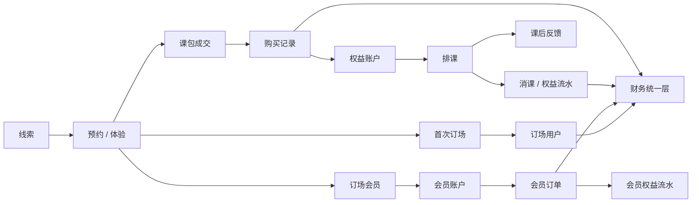

# 核心业务流程

> 版本：2026-07-02
> 状态：重写版 PRD 模块
> 定位：定义 FlowTennis 端到端业务流程、触发条件、写入对象、状态变化、下游影响、异常处理和验收标准。本文档用于让交接方理解“系统怎么跑起来”，不是页面功能摘要。

## PRD 内部引用

> 本文为 PRD 正本内容，复刻系统时只允许引用 PRD 目录内文件；旧 `docs/` 文档仅作为历史迁移来源，不作为交付依赖。

- 00-项目总览.md
- 04-功能清单.md
- 05-全平台数据口径.md
- 06-字段与状态规则.md
- 08-具体需求/
- 09-数据模型与表关系/
- 10-异常场景与安全红线.md
- 11-验收标准与测试门禁.md

## 1. 流程总览

FlowTennis 的核心流程分成 8 条主线：

1. 线索进入与跟进。
2. 线索转体验、转正式学员、转订场、转会员。
3. 教学售卖：课包配置、购买、权益生成。
4. 教学履约：排课、消课、取消、反馈。
5. 场地会员：订场用户、会员开卡 / 续充、储值消费、权益消耗。
6. 财务展示：业务事实进入财务总览、收款流水、入账流水。
7. 教练履约：教练端工作台、教练小程序、反馈和人效。
8. 约球：活动、报名、订场、到场、费用、结清。

核心规则：

1. 业务事实只能写入对应对象，页面不能临时造事实。
2. 指标必须来自统一读模型，不能各页面各算一套。
3. 任何会影响财务、权益、会员余额、校区权限的数据变化，都必须可追溯。
4. 取消、作废、退款、清零、合并不能只改展示状态，必须回写关联对象和流水。

## 2. 全局状态链路

## 3. 线索进入与跟进流程

### 3.1 流程目标

把所有潜在客户统一进入线索池，形成可跟进、可转化、可统计的客户生命周期起点。

### 3.2 参与角色

| 角色 | 参与动作 |
|---|---|
| 总部管理员 | 全量查看、导入、编辑、合并、分配 |
| 校区管理员 / 运营 | 查看和维护授权校区线索 |
| 财务 | 默认不参与线索写入 |
| 教练 | 不直接维护线索，可通过反馈产生运营跟进建议 |

### 3.3 触发入口

| 入口 | 写入对象 |
|---|---|
| 管理后台手动新增线索 | `ft_leads` |
| 线索导入 | `ft_leads`、`ft_lead_import_batches` |
| 学员 / 订场 / 会员历史数据反向生成生命周期线索 | `ft_leads` 或客户生命周期读模型 |
| 教练反馈需要运营跟进 | `ft_feedbacks`，由运营在客户链路里继续跟进 |

### 3.4 标准步骤

1. 运营录入或导入线索。
2. 系统标准化姓名、手机号、来源、需求产品、客户类型、校区、负责人。
3. 系统按手机号、来源线索 ID、历史关联对象检查是否可能重复。
4. 有重复时合并到同一线索或进入异常处理。
5. 运营新增跟进记录。
6. 跟进记录同步更新线索最近跟进、下次跟进、阶段。
7. 线索进入客户生命周期读模型。
8. 线索池、转化与留存、经营分析使用同一生命周期结果。

### 3.5 状态变化

| 当前阶段 | 触发动作 | 下一阶段 |
|---|---|---|
| 新线索 | 录入有效跟进 | 跟进中 |
| 跟进中 | 预约体验课 | 已约体验 |
| 已约体验 | 体验课到课 | 已体验待成交 |
| 任意有效阶段 | 购买课包 / 首次订场 / 开会员 | 已成交 |
| 任意有效阶段 | 明确不再继续 | 已流失 |
| 任意阶段 | 标记无效、重复、测试、误录 | 不进入有效线索统计 |

### 3.6 下游影响

| 下游 | 影响 |
|---|---|
| 普通学员 | 已约体验 / 已体验待成交客户进入普通学员视图 |
| 正式学员 | 课包成交后进入正式学员视图 |
| 订场用户 | 首次订场后进入订场用户视图 |
| 会员管理 | 会员账户创建后进入会员视图 |
| 经营分析 | 影响有效线索、预约体验、已体验、成交、转化率 |

### 3.7 异常处理

| 异常 | 处理 |
|---|---|
| 同手机号多客户 | 不按姓名自动合并，进入异常处理 |
| 线索无手机号 | 可保存，但不能作为强唯一识别 |
| 导入数据缺线索时间 | 使用创建时间，不用历史成交时间反向覆盖 |
| 线索已成交但未关联对象 | 必须补 `studentId/courtId/membershipAccountId` 或保留异常标记 |

### 3.8 验收标准

1. 同一客户在线索池、普通学员、正式学员、订场用户、会员管理中身份一致。
2. 线索池顶部数字和转化与留存漏斗使用同一指标来源。
3. 无效、重复、测试、误录线索不进入有效线索分母。
4. 跟进记录能回到线索详情查看。

## 4. 线索转体验 / 转成交流程

### 4.1 流程目标

把线索从“运营跟进”推进到“体验课 / 正式课程 / 订场 / 会员”的真实业务事实。

### 4.2 转体验

触发：

1. 运营在排课中创建体验课。
2. 或线索详情记录体验时间。

写入：

| 对象 | 写入内容 |
|---|---|
| `ft_schedule` | 体验课排课、教练、校区、场地、时间 |
| `ft_leads` | `leadStage=已约体验`，体验时间 |
| 客户生命周期 | `trialAtRaw`、`studentStage`、体验状态 |

规则：

1. 体验课不等于正式成交。
2. 体验课必须能关联客户，最好关联 `sourceLeadId`。
3. 已到课后才能进入“已体验待成交”。

### 4.3 转课包成交

触发：

1. 客户购买正式课包。

写入：

| 对象 | 写入内容 |
|---|---|
| `ft_students` | 如无学员档案，创建或关联学员 |
| `ft_purchases` | 购买记录、金额、课包快照 |
| `ft_entitlements` | 自动生成权益账户 |
| `ft_leads` | 关联 `studentId`，成交类型含课程 |
| 财务统一层 | 课包收入、待履约 |

规则：

1. 正式学员身份由有效正式课包购买 / 权益推导。
2. 体验课购买不应直接算正式课包成交。
3. 购买作废后，正式学员状态需要由剩余有效事实重新推导。

### 4.4 转订场 / 会员成交

触发：

1. 客户产生有效订场消费。
2. 客户开卡、续充或充值会员。

写入：

| 对象 | 写入内容 |
|---|---|
| `ft_courts` | 订场用户和消费历史 |
| `ft_membership_accounts` | 会员账户 |
| `ft_membership_orders` | 会员订单 |
| `ft_membership_benefit_ledger` | 赠送权益 |
| `ft_leads` | 关联 `courtId/membershipAccountId`，成交类型含订场 / 会员 |
| 财务统一层 | 订场收入、会员储值收入、待履约 |

验收：

1. 线索成交类型能表达课程、订场、订场会员及组合。
2. 总成交人数按客户去重，不按订单或线索条数累加。
3. 同一客户既买课又订场，只算一个总成交客户，但分链路指标分别计入。

## 5. 课包配置与购买流程

### 5.1 流程目标

把“可售卖课程商品”变成“某学员的一笔购买”和“可履约权益”。

### 5.2 标准步骤

1. 总部管理员配置课包。
2. 课包上架后可被购买。
3. 运营选择学员、课包、购买日期、实收金额、支付方式。
4. 服务端保存购买记录。
5. 服务端根据购买记录和课包快照生成权益账户。
6. 页面刷新后，正式学员详情、课包余额、财务收入同步变化。

### 5.3 写入对象

| 步骤 | 对象 | 关键字段 |
|---|---|---|
| 配置商品 | `ft_packages` | 价格、课时、有效期、可用校区、可用教练、时段 |
| 购买 | `ft_purchases` | 学员、课包快照、实收、支付方式、购买日期 |
| 生成权益 | `ft_entitlements` | 总课时、剩余课时、有效期、规则快照 |
| 财务展示 | 财务统一层 | 收款、待履约 |

### 5.4 状态规则

| 对象 | 状态 | 说明 |
|---|---|---|
| 课包 | `active` | 可售卖 |
| 课包 | `inactive` | 停售，不影响历史购买 |
| 课包 | `merged` | 已并入其他课包 |
| 购买 | `active` | 有效购买 |
| 购买 | `voided/refunded` | 作废 / 退款，不计有效收入 |
| 权益 | `active` | 可排课使用 |
| 权益 | `depleted` | 剩余课时为 0 |
| 权益 | `expired` | 超过有效期 |
| 权益 | `voided` | 来源购买作废或权益作废 |

### 5.5 异常处理

| 异常 | 处理 |
|---|---|
| 课包停售后购买 | 不允许新购买 |
| 学员不存在 | 不允许创建购买，或先创建学员 |
| 课包已被合并 | 应提示选择主课包 |
| 已有消课流水后修改购买核心字段 | 拒绝，只允许备注类维护 |
| 作废购买 | 同步作废权益，并写权益流水 |

### 5.6 验收标准

1. 新增购买后能在购买记录看到。
2. 学员详情能看到新权益。
3. 权益剩余课时等于总课时减已消耗。
4. 财务收款和待履约增加。
5. 作废购买后，权益不可继续排课，财务口径可追溯。

## 6. 排课、消课、取消与反馈流程

### 6.1 流程目标

把学员权益转化成真实课程履约，并把履约结果反馈给运营、教练人效和财务入账。

### 6.2 标准排课步骤

1. 运营选择学员。
2. 系统推荐或运营选择可用权益。
3. 运营选择教练、校区、场地、课程类型、时间、课时数。
4. 服务端校验权益规则。
5. 保存排课。
6. 如排课即消课或课程完成后消课，写权益流水并更新权益余额。
7. 教练端显示课程。
8. 课后教练提交反馈。

### 6.3 排课校验

| 校验项 | 规则 |
|---|---|
| 学员 | 排课学员必须和权益学员匹配 |
| 课程类型 | 排课课程类型必须和权益课程类型兼容 |
| 剩余课时 | `remainingLessons >= lessonCount` |
| 有效期 | 上课时间在权益有效期内 |
| 可用日期 | 符合 `usageStartDate/usageEndDate` |
| 可用时段 | 符合 `dailyTimeWindows/timeBand` |
| 可用教练 | 教练在权益可用教练范围内，或规则允许不限 |
| 可用校区 | 校区在权益可用校区范围内，或规则允许不限 |
| 人数上限 | 班课人数不超过权益 / 课包规则 |
| 权限 | 操作人能管理该校区；教练只能操作本人课程 |

### 6.4 写入对象

| 动作 | 写入对象 |
|---|---|
| 新增排课 | `ft_schedule` |
| 消课 | `ft_entitlement_ledger`，更新 `ft_entitlements` |
| 取消排课 | 更新 `ft_schedule.status=已取消`，必要时回退权益和储值消费 |
| 反馈 | `ft_feedbacks` |
| 教练提案 / 教案 | `ft_coach_proposals` |
| 财务入账 | 财务统一层 |

### 6.5 状态变化

| 当前状态 | 触发 | 下一状态 |
|---|---|---|
| 已排课 | 到达结束时间 | 展示为已结束 |
| 已排课 | 运营取消 | 已取消 |
| 已结束 | 教练提交反馈 | 已反馈 / 反馈完成 |
| 已结束 | 未提交反馈 | 待反馈 |
| 已取消 | 重新排课 | 新建排课，不复用旧排课事实 |

### 6.6 取消规则

1. 未消课排课取消：只更新排课状态和取消原因。
2. 已消课排课取消：必须回退权益课时，并写回退流水。
3. 如果排课关联会员储值或订场消费，也必须回退对应消费记录。
4. 已有反馈的排课取消，需要明确处理反馈是否保留为历史记录。

### 6.7 下游影响

| 下游 | 影响 |
|---|---|
| 权益余额 | 消课减少，取消回退增加 |
| 财务入账 | 消课增加已入账，取消可能回退 |
| 教练工作台 | 显示本人课程和待反馈 |
| 教练人效 | 课时量、反馈完成率、转化率 |
| 学员详情 | 上课记录、剩余课时、反馈 |
| 经营分析 | 教学收入、已入账、教练效率 |

### 6.8 验收标准

1. 排课能在管理后台和对应教练端同时看到。
2. 消课后权益余额正确减少。
3. 权益流水可追溯到排课。
4. 取消后余额和财务回退正确。
5. 教练反馈提交后，管理后台反馈状态和教练人效同步变化。

## 7. 订场用户与场地消费流程

### 7.1 流程目标

记录场地客户、订场消费、会员余额消费，并让订场用户页、会员管理、财务和经营分析使用同一事实。

### 7.2 标准步骤

1. 运营创建或导入订场用户。
2. 录入订场消费、扣款、会员消费或历史记录。
3. 系统更新订场用户累计消费、累计订场次数、余额等展示字段。
4. 财务统一层读取有效订场历史。
5. 经营分析展示订场收入、场时、复订和利用率。

### 7.3 写入对象

| 动作 | 写入对象 |
|---|---|
| 创建订场用户 | `ft_courts` |
| 订场消费 | `ft_courts.history` |
| 会员储值扣款 | `ft_courts.history`，可能关联 `ft_membership_accounts` |
| 合并订场用户 | 更新源 `ft_courts` 为 `inactive`，写 `mergedIntoCourtId` |
| 删除 / 隐藏 | `status=inactive` 或 `deletedAt` |

### 7.4 关键规则

1. 订场用户是场地客户主表，也是会员账户的客户来源。
2. `history` 是财务关键字段，不能作为普通备注处理。
3. 合并或删除订场用户不能删除历史财务记录。
4. 校区管理员只能写授权校区订场用户。
5. 订场收入必须进入财务和经营分析同一口径。

### 7.5 验收标准

1. 订场用户列表累计订场次数、累计消费不是页面临时假算。
2. 订场详情能看到消费历史。
3. 财务总览能体现有效订场收入。
4. 场地运转能体现订场场时和利用率。

## 8. 会员开卡、续充、消费与清零流程

### 8.1 流程目标

把订场会员的充值、余额、赠送权益、消费、到期延长、清零、作废全部串成可追溯链路。

### 8.2 开卡 / 续充步骤

1. 运营选择订场用户。
2. 选择会员方案。
3. 填写充值金额、赠送金额、支付方式、生效日期。
4. 服务端创建会员账户或更新已有账户。
5. 服务端创建会员订单。
6. 服务端写入订场用户 `history`。
7. 服务端写入会员权益赠送流水。
8. 财务总览增加总收入、会员储值收入、待履约收入。

### 8.3 写入对象

| 动作 | 写入对象 |
|---|---|
| 开卡 | `ft_membership_accounts`、`ft_membership_orders` |
| 续充 | 更新 `ft_membership_accounts`，新增 `ft_membership_orders` |
| 赠送权益 | `ft_membership_benefit_ledger` |
| 充值历史 | `ft_courts.history` |
| 自动延长 | `ft_membership_account_events`，更新账户 `status=extended` |
| 到期清零 | `ft_membership_account_events`，更新账户 `status=cleared` |
| 作废 / 退款 | 更新订单状态，写追溯 |

### 8.4 财务规则

| 动作 | 总收入 | 待履约 | 已入账 |
|---|---|---|---|
| 会员充值 | 增加 | 增加 | 不增加 |
| 储值消费 | 不重复增加现金收入 | 减少 | 增加 |
| 赠送权益消费 | 不增加现金收入 | 按规则处理 | 按消耗确认 |
| 作废 / 退款 | 按退款 / 冲正规则回退 | 回退 | 回退 |

### 8.5 状态变化

| 当前状态 | 触发 | 下一状态 |
|---|---|---|
| 无账户 | 首次开卡 | `active` |
| `active` | 到有效期仍有余额 | `extended` |
| `extended` | 超过最晚清零日 | `cleared` |
| 任意 | 作废账户 | `voided` |
| `cleared` | 再次充值 | 新周期 `active` 或按续充规则更新 |

### 8.6 异常处理

| 异常 | 处理 |
|---|---|
| 订场用户不存在 | 不允许开卡 |
| 会员方案停售 | 不允许新订单 |
| 订单作废 | 需回退账户、权益、财务，并保留原因 |
| 余额不足消费 | 禁止扣款或进入补差流程 |
| 到期后仍消费 | 必须按延长期 / 清零规则判断 |

### 8.7 验收标准

1. 开卡后会员管理出现会员账户。
2. 会员订单、订场用户历史、会员权益流水能互相追溯。
3. 充值后财务总收入和待履约增加，已入账不直接增加。
4. 消费后余额减少，已入账增加。
5. 到期延长和清零有账户事件记录。

## 9. 财务展示流程

### 9.1 流程目标

把课包、消课、订场、会员储值、会员消费等业务事实，统一展示到财务总览、收款流水和入账流水。

### 9.2 财务来源

| 财务事实 | 来源对象 |
|---|---|
| 课包收款 | `ft_purchases` |
| 课包消课入账 | `ft_entitlement_ledger`、`ft_schedule`、`ft_entitlements` |
| 订场收入 | `ft_courts.history` |
| 会员储值收入 | `ft_membership_orders` |
| 会员消费入账 | `ft_courts.history`、`ft_membership_benefit_ledger` |
| 手工财务流水 | `ft_financial_ledger` |
| 已核对历史 | 财务快照 / 基线 |

### 9.3 标准步骤

1. 业务对象发生写入。
2. 财务统一层读取相关事实。
3. 按统一口径生成总收入、收款流水、已入账流水、待履约。
4. 财务页面只展示统一层结果。
5. 经营分析引用同一财务结果。

### 9.4 禁止规则

1. 财务页面不能自己扫描业务表重算金额。
2. 经营分析不能和财务中心使用不同收入口径。
3. 生产导入后不能只查数据库，必须查线上页面接口和前端展示。
4. 财务快照升级必须有明确基线和核对记录。

### 9.5 验收标准

1. 新增课包购买后，收款流水增加，待履约增加。
2. 消课后，已入账增加，待履约减少。
3. 会员充值后，总收入和会员储值收入增加，已入账不直接增加。
4. 会员消费后，已入账增加。
5. 财务总览、收款流水、入账流水、经营分析金额一致。

## 10. 教练端工作台与小程序流程

### 10.1 流程目标

让教练只处理自己相关课程，完成看课表、看学员、提交反馈、查看个人工作量。

### 10.2 端和页面

| 端 | 页面 | 核心能力 |
|---|---|---|
| 教练端 Web/PWA | 工作台 | 今日 / 近期课程、待反馈、统计摘要 |
| 教练端 Web/PWA | 排课 / 日程 | 本人课程列表和详情 |
| 教练端 Web/PWA | 学员 / 反馈 | 本人相关学员、课后反馈 |
| 教练端 Web/PWA | 个人 / 绑定 | 账号、微信绑定、改密码 |
| 教练小程序 | 工作台 | 本人今日课程和待办 |
| 教练小程序 | 日程 | 本人课表 |
| 教练小程序 | 反馈 | 提交课后评价 |
| 教练小程序 | 我的 | 登录、绑定、账号状态 |

### 10.3 数据范围

教练端只返回：

1. `coachId/coachName` 匹配当前教练的排课。
2. 这些排课关联的学员。
3. 这些排课关联的反馈。
4. 这些排课关联的安全权益投影。
5. 教练本人统计。

教练端不返回：

1. 完整客户池。
2. 订场用户和会员账户。
3. 完整财务。
4. 其他教练的课程和反馈。

### 10.4 标准步骤

1. 管理员创建教练资料。
2. 管理员创建教练账号并绑定 `coachId`。
3. 教练账号登录 Web 或微信绑定。
4. 系统按教练本人范围返回数据。
5. 管理员排课后，课程出现在教练端。
6. 教练上课后提交反馈。
7. 反馈回流管理后台和教练人效。

### 10.5 验收标准

1. 教练甲看不到教练乙课程。
2. 教练甲无法提交教练乙课程反馈。
3. 管理后台排课后，教练端能看到。
4. 教练提交反馈后，管理后台待反馈数量减少。
5. 教练人效里的课时量、反馈完成率同步变化。

## 11. 约球流程

### 11.1 流程目标

支持用户在约球小程序中报名活动，运营确认订场，到场后确认费用和结清，并在必要时同步到主业务财务边界。

### 11.2 标准步骤

1. 运营或用户发布约球活动。
2. 用户报名。
3. 满足人数或运营确认后，活动进入已订场。
4. 活动开始后进入进行中或待确认到场。
5. 运营确认到场名单。
6. 系统生成 AA 应收。
7. 用户支付或运营确认收款。
8. 全部费用处理完成后活动结清。
9. 取消、退款、转让等动作写操作日志和费用状态。

### 11.3 状态变化

| 当前状态 | 触发 | 下一状态 |
|---|---|---|
| `open` | 报名满员 | `full` |
| `open/full` | 运营确认订场 | `booked` |
| `booked` | 到活动时间 | `playing` 或 `attendance_pending` |
| `attendance_pending` | 确认到场 | `fee_pending` |
| `fee_pending` | 费用全部处理 | `settled` |
| 任意未结清 | 取消 | `cancelled` |

### 11.4 写入对象

| 动作 | 对象 |
|---|---|
| 发布活动 | `match_posts` |
| 报名 | `match_registrations` |
| 取消报名 | 更新 `match_registrations.registrationStatus=cancelled` |
| 确认订场 | 更新 `match_posts.bookingStatus/status` |
| 确认到场 | 更新报名到场状态 |
| 生成 AA | `match_fee_splits` |
| 收款 / 退款 | 更新 `match_fee_splits.payStatus/paidAmount` |
| 取消 / 修改 / 财务动作 | `match_operation_logs` |

### 11.5 权限规则

| 动作 | 权限 |
|---|---|
| 活动管理 | `match_ops` |
| 取消活动 | `match_ops` |
| 到场确认 | `match_ops` |
| 费用确认 | `match_finance` |
| 退款 / 结算 | `match_finance` |

### 11.6 验收标准

1. 报名人数、活动状态、报名列表一致。
2. 取消报名后不再计入有效人数。
3. 到场名单决定费用分摊对象。
4. 费用分摊合计等于最终应收。
5. 收款、退款、取消都有操作日志。
6. 如果同步订场财务，主业务侧能追溯到约球来源。

## 12. 账号与权限变更流程

### 12.1 流程目标

保证新增人员、离职、校区调整、教练绑定、约球权限变更都能被安全管理。

### 12.2 标准步骤

1. 总部管理员进入账号管理。
2. 创建或编辑账号。
3. 选择角色、数据范围、校区、绑定教练、约球权限。
4. 服务端归一化权限字段。
5. 停用账号时保留历史业务数据。
6. 如需解绑微信或服务号，由管理员执行解绑。

### 12.3 写入对象

| 动作 | 对象 |
|---|---|
| 创建账号 | `ft_users` |
| 更新账号 | `ft_users` |
| 重置密码 | `ft_users.password` |
| 停用账号 | `ft_users.status=inactive` |
| 绑定 / 解绑微信 | `ft_users.wechatOpenId`、`ft_user_wechat_index` |
| 绑定 / 解绑服务号 | `ft_users.officialAccountOpenId` |

### 12.4 验收标准

1. 教练账号必须绑定教练。
2. 校区管理员必须至少绑定一个校区。
3. 停用账号不能登录。
4. 校区范围改变后，列表、详情、聚合数据同步裁剪。
5. 约球权限改变后，约球管理动作立即按新权限判断。

## 13. 校区扩展流程

### 13.1 流程目标

支持未来新增校区时，不需要重写客户、教学、订场、会员、财务和权限体系。

### 13.2 标准步骤

1. 总部管理员创建校区。
2. 配置校区基础信息、场地、价格、可售课包 / 会员方案适用范围。
3. 给校区管理员账号绑定 `campusIds`。
4. 新线索、学员、排课、订场、会员订单写入新校区。
5. 财务和经营分析按校区维度自然出现。

### 13.3 必须支持的扩展点

| 扩展点 | 要求 |
|---|---|
| 权限 | `campusIds` 支持多校区 |
| 商品 | 课包和会员方案支持适用校区 |
| 排课 | 排课必须有校区 |
| 订场 | 订场用户和历史记录能归属校区 |
| 财务 | 收入能按校区筛选 / 汇总 |
| 经营分析 | 线索、转化、场地、教练可按校区看 |

### 13.4 验收标准

1. 新校区账号只看到新校区数据。
2. 总部账号能跨校区查看。
3. 新校区排课、订场、会员、财务都能正常串联。
4. 无校区数据不会被错误归到某个校区。

## 14. 全流程验收清单

交接方复原系统时，至少跑通以下端到端用例：

| 用例 | 必须看到的结果 |
|---|---|
| 新线索 -> 跟进 -> 预约体验 -> 到课 -> 购买课包 | 线索阶段、普通学员、正式学员、购买、权益、财务全部同步 |
| 购买课包 -> 排课 -> 消课 -> 反馈 | 权益余额减少、权益流水存在、教练端可见、反馈回流 |
| 排课取消 | 排课状态取消、权益回退、财务回退或不重复入账 |
| 订场用户 -> 会员开卡 -> 会员消费 | 订场用户历史、会员账户、会员订单、权益流水、财务链路一致 |
| 会员到期延长 / 清零 | 账户状态变化，有账户事件 |
| 校区管理员操作本校区数据 | 可读可写授权范围 |
| 校区管理员操作其他校区数据 | 拒绝或不可见 |
| 教练查看工作台并提交反馈 | 只看本人课程，反馈能提交并进入统计 |
| 约球报名 -> 订场 -> 到场 -> 费用结清 | 活动状态、报名、费用、日志闭环 |
| 财务总览、收款流水、入账流水核对 | 同一业务动作在三处展示符合统一口径 |

## 15. 不允许出现的流程断点

1. 线索池一个数字，转化与留存另一个数字。
2. 普通学员只从 `students` 表筛，漏掉已预约但未建档客户。
3. 正式学员由人工状态决定，而不是购买 / 权益事实推导。
4. 购买生成了，但没有权益。
5. 排课消课了，但没有权益流水。
6. 权益流水有了，但财务入账没有变化或无法解释。
7. 会员充值显示在会员页，但财务总览没有同步。
8. 数据库写入了，但线上页面接口和前端展示没生效就宣布完成。
9. 教练端能看到其他教练课程。
10. 校区管理员能通过接口写其他校区数据。
11. 约球费用结清没有操作日志。
12. 作废、退款、取消只改状态，不保留原因和操作人。
